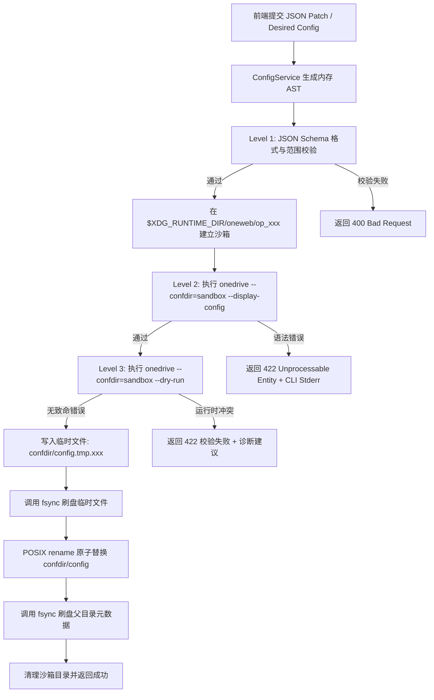
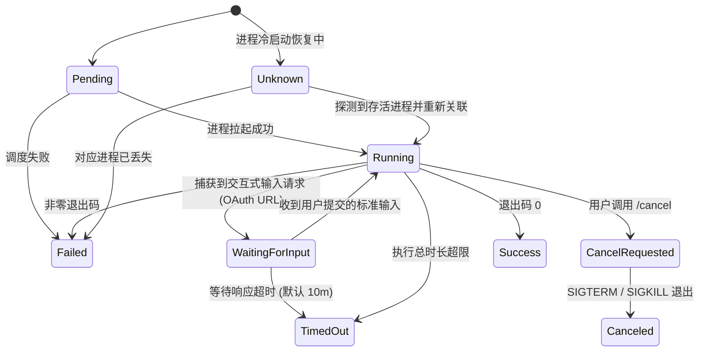
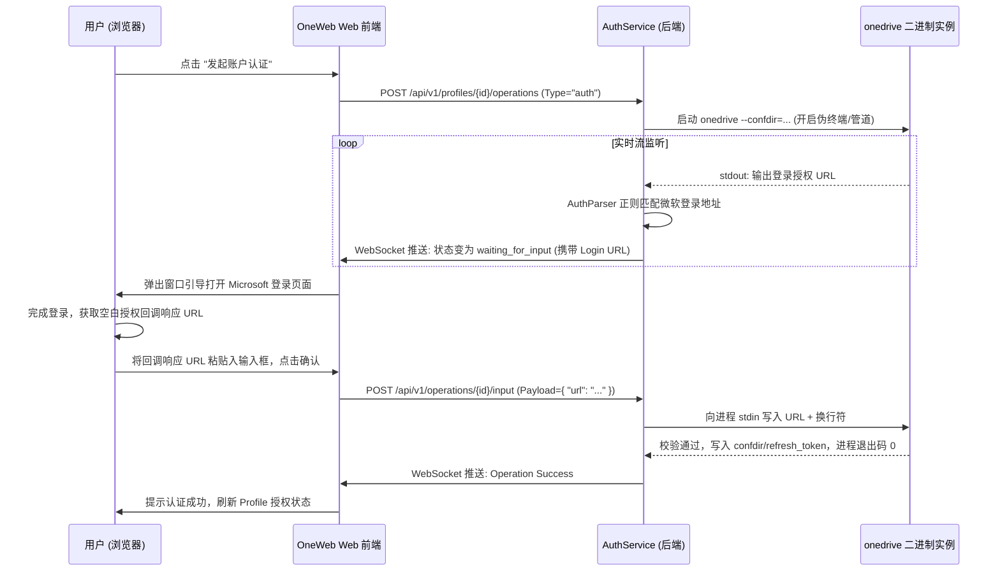
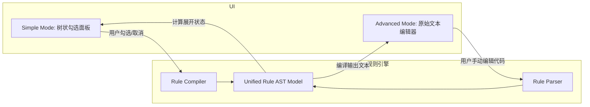
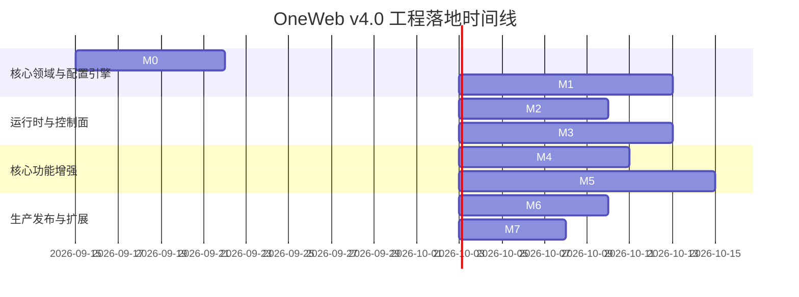

# OneWeb 软件开发规划与架构设计规范书 (v4.0)

---

## 文档元数据与控制信息

| 属性 | 内容 |
| :--- | :--- |
| **项目名称** | OneWeb (Web Control Plane for `abraunegg/onedrive`) |
| **文档版本** | v4.0-FINAL |
| **文档性质** | 系统架构规范、工程实现基准与开发任务拆分指导书 |
| **目标系统** | Linux (amd64 / arm64), systemd `--user`, Docker / Podman |
| **依赖底座** | `abraunegg/onedrive` (基准兼容版本: ≥ 2.5.11, 向后支持 2.4.x) |
| **核心技术栈** | Go 1.22+ (`net/http` + `chi`), Vue 3, TypeScript, Tailwind CSS |

---

## 目录

1. [项目定位与核心边界](#1-项目定位与核心边界)
2. [核心架构与设计原则](#2-核心架构与设计原则)
3. [系统总体分层架构](#3-系统总体分层架构)
4. [核心领域模型 (Domain Model)](#4-核心领域模型-domain-model)
5. [配置引擎 (Config Engine) 专项设计](#5-配置引擎-config-engine-专项设计)
6. [运行时控制面 (Runtime Control Plane)](#6-运行时控制面-runtime-control-plane)
7. [异步操作引擎 (Operation Engine) 与事件系统](#7-异步操作引擎-operation-engine-与事件系统)
8. [认证辅助子系统 (Authentication Assistant)](#8-认证辅助子系统-authentication-assistant)
9. [规则引擎：SyncList 深度设计](#9-规则引擎synclist-深度设计)
10. [数据与版本兼容策略 (Compatibility Policy)](#10-数据与版本兼容策略-compatibility-policy)
11. [安全架构与访问控制](#11-安全架构与访问控制)
12. [通信协议与 API 规范](#12-通信协议与-api-规范)
13. [工程结构与技术栈定案](#13-工程结构与技术栈定案)
14. [质量保障与测试策略](#14-质量保障与测试策略)
15. [工程里程碑与交付路线 (Milestones)](#15-工程里程碑与交付路线-milestones)
16. [架构红线 (Architectural Invariants)](#16-架构红线-architectural-invariants)

---

## 1. 项目定位与核心边界

### 1.1 项目定位
**OneWeb** 是面向 Linux 平台 `abraunegg/onedrive` 官方客户端的**轻量级 Web 控制面（Web Control Plane）**。

OneWeb 不实现 OneDrive 同步协议，不替代 Microsoft Graph，不自建同步数据库，不维护第三方的 OAuth Token 存储体系。它的核心使命是为底层的 CLI 同步引擎提供可靠、直观、安全的现代化图形控制与观察能力。

### 1.2 职责边界划分

```text
┌────────────────────────────────────────────────────────┐
│                   OneWeb 控制面 (Control Plane)         │
│  • 配置生命周期管理 (AST 增删改查)                       │
│  • 交互式 OAuth 认证流程引导                            │
│  • 运行时进程与服务管理 (systemd / 容器)                 │
│  • 同步状态、日志、指标与健康度观察                     │
│  • SyncList 选择性同步规则可视化与编译                   │
└───────────────────────────┬────────────────────────────┘
                            │ (声明配置 / 控制信号 / 状态观测)
┌───────────────────────────▼────────────────────────────┐
│              底层 onedrive 同步引擎 (Data Plane)         │
│  • Microsoft Graph API 通信与鉴权                      │
│  • OAuth 令牌生命周期与持久化                           │
│  • 本地文件系统事件监听与远端轮询 (inotify)              │
│  • 本地元数据状态库维护 (items.sqlite3)                 │
│  • 文件块传输、断点续传、并发上传与下载                 │
└────────────────────────────────────────────────────────┘
```

> **核心判定准则**：OneWeb 管理**“意图、控制与观察”**；OneDrive 客户端管理**“认证、同步与状态”**。

---

## 2. 核心架构与设计原则

### 2.1 事实单一来源 (SSOT) 规范
OneWeb 严格避免在控制面维护影子配置库。权威来源分为三类：

| 数据载体 | 权威归属 | OneWeb 权限 | 业务说明 |
| :--- | :--- | :--- | :--- |
| `config` | 用户/文件系统 | 读 / 写 (AST) | 静态配置声明；官方客户端支持无文件启动（使用默认内置值） |
| `sync_list` | 用户/文件系统 | 读 / 写 (规则模型) | 选择性同步白名单规则（Allow-list） |
| `items.sqlite3` | OneDrive 客户端 | **只读 (Read-only)** | 同步状态机数据库，严禁外部写入，不作为稳定公开 API 依赖 |

### 2.2 最小元数据声明 (Minimal Metadata)
OneWeb 自身只在宿主机保存唯一的声明式元数据文件：`~/.config/oneweb/profiles.json`。
* **允许持久化**：Profile 身份标识 (`id`)、显示名称 (`display_name`)、配置目录 (`confdir`)、运行时类型 (`runtime.type`)、运行时目标 (`runtime.target`)。
* **严禁持久化**：`sync_dir`、`threads`、`rate_limit`、`skip_file`、`skip_dir` 等任何同步业务参数。所有同步业务参数必须实时回溯至对应 Profile 的 `config` 文件。

### 2.3 Schema 驱动的配置表单 (Schema-Driven UI)
配置系统解耦为 **语义定义层 (Semantic Schema)** 与 **UI 元数据层 (UI Metadata)**：
* **Semantic Schema**：定义键名、强类型、默认值、取值范围、版本约束、互斥依赖。
* **UI Metadata**：定义前端渲染组件（Switch, Slider, Input, Select）、分组分类、专家模式标志、单位换算及文档说明。

```text
官方应用配置文档 ───> OneWeb 语义规范 (JSON) ───> UI 元数据 ───> Vue 响应式动态表单
```

---

## 3. 系统总体分层架构

系统采用经典的整洁架构（Clean Architecture / 4-Layer Architecture），严格遵循单向依赖规则：**Domain 层对外零依赖（不知道 HTTP、Docker 或 WebSocket Channel）**。

```text
┌────────────────────────────────────────────────────────┐
│             Presentation Layer (Vue 3 + TS)            │
│       Tailwind CSS + HeadlessUI + WebSocket Client     │
└───────────────────────────┬────────────────────────────┘
                            │ REST / WebSocket
┌───────────────────────────▼────────────────────────────┐
│                       API Layer                        │
│             chi Router / WebSocket Gateway             │
└───────────────────────────┬────────────────────────────┘
                            │ DTO / Command
┌───────────────────────────▼────────────────────────────┐
│                   Application Layer                    │
│  ProfileService  ConfigService  RuntimeService         │
│  OperationService  AuthService  SyncService            │
└───────────────────────────┬────────────────────────────┘
                            │ Domain Entities / Repositories
┌───────────────────────────▼────────────────────────────┐
│                     Domain Layer                       │
│  Profile  ConfigAST  ConfigSchema  RuntimeSnapshot     │
│  Operation (State Machine)  SyncRule  Capability       │
└───────────────────────────┬────────────────────────────┘
                            │ Interfaces Implementation
┌───────────────────────────▼────────────────────────────┐
│                Infrastructure Layer                    │
│  • Filesystem (Atomic IO)   • onedrive CLI Adapter     │
│  • systemd (User Bus/D-Bus) • Docker Engine Client     │
│  • journalctl Streamer      • Event Bus (In-Memory)    │
└────────────────────────────────────────────────────────┘
```

---

## 4. 核心领域模型 (Domain Model)

### 4.1 Profile (配置轮廓)
Profile 仅表示“如何定位并驱动一个独立的 OneDrive 实例”。

```go
type RuntimeType string

const (
    RuntimeSystemd RuntimeType = "systemd"
    RuntimeDocker  RuntimeType = "docker"
    RuntimePodman  RuntimeType = "podman"
)

type Profile struct {
    ID            string      `json:"id"`
    DisplayName   string      `json:"display_name"`
    ConfDir       string      `json:"confdir"`        // 宿主机路径 (Native) 或容器映射路径
    RuntimeType   RuntimeType `json:"runtime_type"`
    RuntimeTarget string      `json:"runtime_target"` // systemd unit 名 或 container 名
}
```

> **注意**：Profile 模型中绝对不包含 `sync_dir`，因为 `sync_dir` 由 `confdir/config` 唯一裁定。

### 4.2 Config 节点与 AST 模型
配置文档在内存中抽象为节点树，确保任何未识别的内容都不会在反序列化或回写时发生丢失：

```go
type NodeType int

const (
    NodeKeyValue NodeType = iota
    NodeDisabledKeyValue  // 被注释但具有语义的选项: # sync_dir = "..."
    NodeComment           // 纯注释行: # This is a comment
    NodeBlankLine         // 空行
)

type ConfigNode struct {
    Type          NodeType
    RawText       string
    Key           string
    Value         string
    InlineComment string
    LineNumber    int
}

type ConfigDocument struct {
    Nodes []ConfigNode
}
```

### 4.3 Operation (异步工作单元)
所有耗时或阻塞调用（同步、Dry Run、Auth 握手、Resync）均纳入统一的生命周期管理：

```go
type OperationStatus string

const (
    OpPending         OperationStatus = "pending"
    OpRunning         OperationStatus = "running"
    OpWaitingForInput OperationStatus = "waiting_for_input" // 用于 OAuth 授权码回填
    OpCancelRequested OperationStatus = "cancel_requested"
    OpSuccess         OperationStatus = "success"
    OpFailed          OperationStatus = "failed"
    OpCanceled        OperationStatus = "canceled"
    OpTimedOut        OperationStatus = "timed_out"
    OpUnknown         OperationStatus = "unknown"          // 节点重启后的未定状态
)

type Operation struct {
    ID        string          `json:"id"`
    ProfileID string          `json:"profile_id"`
    Type      string          `json:"type"` // "auth", "sync", "dry-run", "resync"
    Status    OperationStatus `json:"status"`
    CreatedAt time.Time       `json:"created_at"`
    StartedAt *time.Time      `json:"started_at,omitempty"`
    EndedAt   *time.Time      `json:"ended_at,omitempty"`
}
```

---

## 5. 配置引擎 (Config Engine) 专项设计

配置管理是 OneWeb 的技术基石。必须保证**配置文件的完全保真**与**多端修改时的绝对安全**。

### 5.1 AST 无损转换与未知项保留 (Unknown Option Preservation)
解析器必须实现以下保证：
1. **语义无损**：解析并重新序列化时，保留原有注释、空行、行内注释和键值声明顺序。
2. **前向兼容**：若读取到底层新版本引入的未知项（例如客户端升至 `2.6.x` 带来的新参数），AST 必须原样保存并回写，禁止丢弃未在当前 Schema 注册的字段。
3. **禁用选项识别**：准确识别形态如 `# key = "value"` 的注释行，将其标记为 `DisabledKeyValue`，便于前端展示“建议开启”状态。

### 5.2 生效配置 (Effective Config) 与文件配置 (File Config) 分离
官方客户端支持在完全没有配置文件的情况下以内部编译默认值启动，且支持 CLI 覆盖。因此后端必须向前端暴露三重配置对比：

```text
Built-in Defaults (客户端硬编码默认值)
          +
File Config (confdir/config 显式声明覆盖项)
          +
Runtime Flags (运行参数)
          =
Effective Config (最终生效配置)
```

API `GET /api/v1/profiles/{id}/config` 返回复合结构：
```json
{
  "file_exists": true,
  "file_config": { "threads": 4 },
  "effective_config": { "threads": 4, "sync_dir": "/home/user/OneDrive", "sync_root_files": false },
  "defaults": { "threads": 2, "sync_root_files": false },
  "schema": { },
  "version_meta": { "mtime": 1718000000, "size": 1024, "sha256": "3a7b..." }
}
```

### 5.3 并发控制与外部编辑保护 (Concurrency & Drift Detection)
用户可能在控制台通过 `vim` 或外部脚本直接修改 `config` 文件。OneWeb 必须防止“盲目静默覆盖”：
1. **读取时记录指纹**：记录目标配置文件的 `mtime`、`size` 与 `sha256`。
2. **保存时比对指纹**：前端提交修改时必须回传 `base_sha256`。
3. **冲突拒绝**：若磁盘文件的当前哈希与请求的 `base_sha256` 不一致，立即返回 `409 Conflict`，并附带磁盘最新内容的差异对比，强制前端提示合并或重写。

### 5.4 沙箱三级校验与原子写入 (Sandbox Validation & Atomic Write)



---

## 6. 运行时控制面 (Runtime Control Plane)

### 6.1 运行时后端抽象接口
```go
type RuntimeStatus struct {
    State       string    `json:"state"` // "running", "stopped", "failed", "inactive"
    SubState    string    `json:"sub_state"`
    PID         int       `json:"pid,omitempty"`
    StartedAt   time.Time `json:"started_at,omitempty"`
    MemoryBytes uint64    `json:"memory_bytes,omitempty"`
}

type RuntimeBackend interface {
    Detect(ctx context.Context) Capability
    Start(ctx context.Context, p Profile) error
    Stop(ctx context.Context, p Profile) error
    Restart(ctx context.Context, p Profile) error
    Status(ctx context.Context, p Profile) (RuntimeStatus, error)
    Logs(ctx context.Context, p Profile, opts LogOptions) (<-chan LogEntry, error)
}
```

### 6.2 Systemd User Backend 规范
* **非特权执行**：直接使用原生 User D-Bus 接口或执行 `systemctl --user`，**绝不调用 `sudo`，绝不引入 root 权限提升**。
* **动态 Unit 绑定**：不硬编码 `onedrive@{id}.service`。Profile 必须显式支持任意自定义 Unit 目标（如 `onedrive-personal.service`、`onedrive@default.service`）。
* **用户 Linger 探测**：若用户未开启 `loginctl enable-linger`，SSH 断开或注销时后台服务可能中断。OneWeb 应检测并展示警告标签，引导用户执行配置，但**不主动静默执行提权命令**。

### 6.3 容器后端 (Docker / Podman) 规范
* **Docker Socket 最小权限**：`/var/run/docker.sock` 属于高危接口。OneWeb 后端对 Docker API 进行沙箱化封装，仅开放白名单容器的 `Inspect`、`Start`、`Stop`、`Restart` 与 `Logs` 流式传输，严禁向上暴露原始 Docker API。
* **双向路径语义隔离**：
  * **Native Profile**：`confdir` 与 `sync_dir` 均为宿主机绝对路径。
  * **Container Profile**：容器内部路径固定为 `/onedrive/conf` 与 `/onedrive/data`。OneWeb 需负责管理宿主卷挂载映射（Volume/Bind Mount）以及 UID/GID 权限对其匹配，禁止混淆两类路径。

---

## 7. 异步操作引擎 (Operation Engine) 与事件系统

### 7.1 操作生命周期与状态机转换



### 7.2 事件总线解耦设计
领域操作不直接持有 WebSocket 通道或 HTTP 上下文。所有状态跃迁由领域对象触发 `DomainEvent`，投递至内部 `EventBus`，再由 `WebSocketGateway` 进行扇出分发：

```go
type EventType string

const (
    EvtOpStarted     EventType = "operation.started"
    EvtOpLog         EventType = "operation.log_appended"
    EvtOpNeedInput   EventType = "operation.waiting_input"
    EvtOpCompleted   EventType = "operation.completed"
    EvtOpFailed      EventType = "operation.failed"
    EvtRuntimeChange EventType = "runtime.state_changed"
)

type DomainEvent struct {
    ID        string      `json:"id"`
    Type      EventType   `json:"type"`
    ProfileID string      `json:"profile_id"`
    Timestamp time.Time   `json:"timestamp"`
    Payload   interface{} `json:"payload"`
}
```

---

## 8. 认证辅助子系统 (Authentication Assistant)

### 8.1 架构防线：Token 零存储原则
OneWeb **不截断 OAuth 请求，不自建回调 HTTP Server，不保存 Refresh Token**。底层的 OAuth 会话维护全权交由 `onedrive` 官方 CLI 处理。OneWeb 充当智能的 **终端 I/O 桥接适配器**。

### 8.2 认证执行时序



### 8.3 认证能力探测 (Capability Detection)
并非所有环境都使用标准浏览器授权重定向。新版客户端具备多样化认证扩展：
* `use_device_auth`：设备代码认证流（适合无桌面环境的远程终端）。
* `use_intune_sso`：企业环境 SSO 认证支持。

OneWeb 在初始化阶段通过版本与能力分析，动态调整前端呈现的认证引导步骤。

---

## 9. 规则引擎：SyncList 深度设计

### 9.1 官方 Allow-List 核心语义规范
`sync_list` **绝非**普通的排除列表，而是极其严格的**白名单系统**。必须在前端与校验逻辑中固化以下规则：
1. **默认全排除**：未匹配到任何规则的文件/目录默认不进行同步。
2. **显式包含与覆盖**：以 `!` 开头的规则代表排除，未带 `!` 的代表包含；越靠后的规则优先级越高。
3. **斜杠敏感性**：
   * 包含前导斜杠（如 `/Documents`）：仅精确匹配根目录下的 `Documents`。
   * 不含斜杠（如 `Documents`）：将在整个目录树的任意深度递归匹配名为 `Documents` 的对象，带来极高 CPU 与 I/O 开销。
4. **性能预警**：OneWeb 规则编译器检测到规则未声明前导 `/` 时，自动在 UI 上标注 **Performance Warning**。

### 9.2 Simple Mode 与 Advanced Mode 双向同步架构
用户在可视化文件树勾选与直接编写规则文本必须映射至统一的中间规则模型：



### 9.3 强制 Resync 警报机制
根据官方规范，**任何对 `sync_list` 规则的修改，都必须执行客户端全量重新同步 (`--resync`) 才能生效**。
保存流程严禁静默结束：
* 前端提交保存时，弹出显式风险确认框。
* 提供三种提交行为：
  1. `Save Only`：仅持久化文件，提示用户后续需手动重步。
  2. `Save + Dry Run`：保存后自动触发带 `--dry-run` 的 Operation，预览同步影响。
  3. `Save + Resync`：保存后立即停止后台守护服务，拉起 `--resync` 专项 Operation，成功后恢复后台守护进程。

---

## 10. 数据与版本兼容策略 (Compatibility Policy)

### 10.1 客户端版本探测矩阵
OneWeb 服务启动时调用 `onedrive --version`，并解析 SemVer 构建能力上下文：

| 客户端版本区间 | items.sqlite3 架构版本 | 兼容特性与应对策略 |
| :--- | :--- | :--- |
| `< 2.4.25` | Legacy Schema | **标记不推荐**：关闭高级并发配置选项，提示用户升级客户端 |
| `2.4.x` | Schema v2.4 | 支持基础功能，SQLite 查询采用降级视图 |
| `≥ 2.5.0` (当前 2.5.11) | Schema v2.5 (破坏性升级) | 启用全部现代特性：包含设备流认证、细粒度多线程调节、完整动态日志解析 |

### 10.2 数据库安全接入边界
对于 `confdir/items.sqlite3`：
* **只读锁保护**：必须以只读 URI 模式打开：`file:items.sqlite3?mode=ro&_journal_mode=WAL`。
* **零 DDL/DML**：系统内严禁包含任何 `UPDATE`、`INSERT`、`DELETE` 或 `ALTER TABLE` 语句。
* **隔离假设**：不将数据库表结构直接暴露给前端 API，后端统一抽取为 `SyncItemSnapshot` 领域对象，抵御上游官方数据库 schema 变动带来的破坏。

---

## 11. 安全架构与访问控制

```text
┌────────────────────────────────────────────────────────┐
│             Web Client (Remote / Local)                │
└───────────────────────────┬────────────────────────────┘
                            │ HTTPS / TLS (建议反向代理)
┌───────────────────────────▼────────────────────────────┐
│                    Security Filter                     │
│  • Loopback vs LAN 识别                                │
│  • Session Cookie + SameSite=Strict                    │
│  • Double-Submit CSRF Token Filter                     │
│  • Path Sanitization (防止目录穿越)                    │
└───────────────────────────┬────────────────────────────┘
                            │ Authenticated Request
┌───────────────────────────▼────────────────────────────┐
│                  OneWeb Application                    │
│              运行身份: non-root (普通用户)              │
└────────────────────────────────────────────────────────┘
```

1. **网络监听与凭证防御**：
   * 默认绑定地址为 `127.0.0.1:8080`（无需认证即可本地使用）。
   * 显式监听 `0.0.0.0` 时，启动阶段**强制校验认证配置**。未配置安全密钥或账密时拒绝启动，避免内网未授权接管。
2. **路径穿越防御**：所有涉及路径的参数（`confdir`、`sync_dir`、`target`）必须经过 `filepath.Clean` 规范化，并强制验证其归属于合法用户目录内，拒绝任何包含 `../` 的越权逃逸。
3. **WebSocket 鉴权继承**：建立 WebSocket 连接前必须验证 HTTP 握手请求中的 Session 状态。订阅指定 `operation_id` 时，校验该 Operation 是否属于该用户可控的 Profile。

---

## 12. 通信协议与 API 规范

### 12.1 核心 RESTful 端点定义

```http
# 系统级
GET    /api/v1/system/info                  # 获取宿主信息、版本探测与运行时能力
GET    /api/v1/system/capabilities          # 获取当前客户端支持的配置项与认证机制

# Profile 管理
GET    /api/v1/profiles                     # 列出所有配置轮廓
POST   /api/v1/profiles                     # 新建配置轮廓 (初始化 confdir)
GET    /api/v1/profiles/{id}                # 获取指定轮廓详情
PATCH  /api/v1/profiles/{id}                # 更新元数据 (名称/运行时绑定)
DELETE /api/v1/profiles/{id}                # 删除元数据 (默认绝不级联删除云端与本地文件)

# 配置管理 (Config)
GET    /api/v1/profiles/{id}/config         # 获取复合配置 (文件值、生效值、默认值、Schema)
PUT    /api/v1/profiles/{id}/config         # 保存配置 (带版本指纹校验与原子写入)
POST   /api/v1/profiles/{id}/config/validate# 手动触发沙箱静态与运行时校验

# 选择性同步 (SyncList)
GET    /api/v1/profiles/{id}/sync-list      # 获取当前规则源码与解析后的 AST 模型
PUT    /api/v1/profiles/{id}/sync-list      # 更新规则 (可选联动 Resync)
GET    /api/v1/profiles/{id}/sync-list/tree # 扫描并构建远程/本地目录树用于选择

# 服务运行时生命周期控制 (Runtime Actions - 仅针对守护进程)
GET    /api/v1/profiles/{id}/runtime        # 获取守护进程运行状态与性能消耗
POST   /api/v1/profiles/{id}/runtime/actions# 控制服务: {"action": "start" | "stop" | "restart"}

# 异步操作管理 (Operations - 耗时工作单元)
POST   /api/v1/profiles/{id}/operations     # 发起异步任务: {"type": "sync" | "dry-run" | "auth" | "resync"}
GET    /api/v1/profiles/{id}/operations     # 获取历史操作列表
GET    /api/v1/operations/{id}              # 查看单个操作的当前状态与元信息
POST   /api/v1/operations/{id}/input        # 向需要交互的操作注入输入 (OAuth 授权回执)
POST   /api/v1/operations/{id}/cancel       # 中止正在进行的操作
```

### 12.2 WebSocket 协议规范
* **连接路径**：`/ws/v1/operations/{operation_id}`
* **帧格式设计**：采用统一的结构化 JSON 消息体：

```json
{
  "sequence": 42,
  "timestamp": "2026-09-13T12:00:00.123Z",
  "type": "log",
  "data": {
    "stream": "stdout",
    "level": "info",
    "raw": "Downloading 10 items ... 45%",
    "progress": {
      "current": 45,
      "total": 100,
      "unit": "percent"
    }
  }
}
```

> **特别声明**：进度信息（如 `45%`）仅作为 **UI 展示增强**，系统的成功判定与状态机跃迁严格依赖 CLI 的退出码与领域事件，不绑定特定版本的标准输出文本。

---

## 13. 工程结构与技术栈定案

### 13.1 选型定案表

| 维度 | 选用技术 | 选型理由与技术决策 |
| :--- | :--- | :--- |
| **开发语言** | **Go 1.22+** | 内存开销小、静态编译单二进制分发、高并发管道控制与系统原语支持极佳 |
| **HTTP 路由** | **标准库 `net/http` + `chi`** | 业务复杂度在配置与状态机，路由保持轻量标准，无需巨型 Web 框架侵入 |
| **WebSocket** | **`nhooyr.io/websocket`** | 符合标准、内存控制严密、Context 友好，开箱即用 |
| **前端体系** | **Vue 3 + TypeScript + Vite** | 响应式声明非常契合多变 Schema 动态表单；类型系统完备 |
| **UI 样式** | **Tailwind CSS** | 实用类优先，便于快速构建高质感的控制台仪表板 |
| **持久化** | **零外部 DB 依赖** | 本地文件存储元数据 (`profiles.json`)，极轻量部署 |

### 13.2 目录结构布局规范

```text
oneweb/
├── cmd/
│   └── oneweb/
│       └── main.go                         # 程序主入口：环境自检、DI 注入、信号监听
├── internal/
│   ├── domain/                             # 领域层 (纯业务实体与行为，零三方框架依赖)
│   │   ├── profile/                        # Profile 实体、聚合根与仓储接口
│   │   ├── config/                         # Config AST、Node、Token 定义
│   │   ├── runtime/                        # Runtime 状态与 Backend 抽象接口
│   │   ├── operation/                      # Operation 聚合、状态机与转换规则
│   │   ├── sync/                           # SyncRule 模型、Tree 节点定义
│   │   └── capability/                     # 客户端版本能力规约
│   ├── application/                        # 应用服务层 (协调 Use Case 与事务编排)
│   │   ├── profile_service.go
│   │   ├── config_service.go
│   │   ├── runtime_service.go
│   │   ├── operation_service.go
│   │   ├── auth_service.go
│   │   └── sync_service.go
│   ├── infrastructure/                     # 基础设施层 (具体技术实现)
│   │   ├── filesystem/                     # 原子写入、fsync、目录锁、散列计算
│   │   ├── configparser/                   # AST Lexer、Parser 与 Serializer
│   │   ├── onedrive/                       # onedrive CLI 子进程封装与命令执行
│   │   ├── runtime/
│   │   │   ├── systemd/                    # systemd D-Bus / CLI 实现
│   │   │   └── docker/                     # Docker Client SDK 封装
│   │   ├── journal/                        # 日志收集流实现
│   │   └── events/                         # 内存事件总线广播实现
│   └── api/                                # 接入层 (协议映射与参数校验)
│       ├── rest/                           # chi 路由注册、中间件、Controller
│       └── websocket/                      # WS 升级、连接生命周期池、推流处理
├── schema/                                 # 外部元数据契约
│   └── onedrive/
│       ├── semantic/                       # 语义规则 JSON (字段类型、默认值、约束)
│       └── ui/                             # 界面呈现元数据 (组件类型、排序、文案)
├── web/                                    # 前端工程
│   ├── src/
│   │   ├── api/                            # Axios / Fetch 封装与 WS Client
│   │   ├── components/                     # 动态 Schema 表单、日志查看器、文件树
│   │   ├── views/                          # 概览、配置编辑、SyncList、认证辅助
│   │   └── stores/                         # Pinia 状态管理
│   ├── package.json
│   └── vite.config.ts
├── packaging/                              # 交付部署打包清单
│   ├── systemd/                            # oneweb.service 用户级单元文件
│   ├── docker/                             # OneWeb 控制面 Dockerfile
│   └── deb/                                # Debian/Ubuntu 打包脚本
├── tests/                                  # 自动化测试套件
│   ├── fixtures/                           # 测试用各类 config、sync_list 样本
│   ├── unit/                               # AST、并发、状态机单元测试
│   └── integration/                        # CLI 沙箱集成测试
├── docs/                                   # 架构与设计文档库
│   └── architecture.md                     # 本规范书
├── go.mod
└── go.sum
```

---

## 14. 质量保障与测试策略

放弃虚高的代码覆盖率数字指标，将工程测试资源集中于**核心行为的 100% 语义覆盖**：

```text
                    ┌────────────────────────────┐
                    │    E2E UI Flow (Playwright) │  5% 投入
                    └─────────────┬──────────────┘
                                  │
                    ┌─────────────▼──────────────┐
                    │   Sandbox CLI Integration  │ 25% 投入
                    └─────────────┬──────────────┘
                                  │
                    ┌─────────────▼──────────────┐
                    │  Semantic Unit Tests (Go)  │ 70% 投入
                    │  • AST Parse/Modify/Render │
                    │  • Concurrency & SHA256    │
                    │  • SyncList Allow-list AST │
                    │  • Operation State Machine │
                    └────────────────────────────┘
```

### 重点防御的测试矩阵
1. **Config AST 边界**：
   * 包含 UTF-8 BOM 头、混合 CRLF 与 LF、末尾无换行。
   * 单行包含连续行内注释、选项值内含双引号或转义反斜杠。
   * 完全空白的配置文件；只包含注释的配置文件；包含非法语法行的容错策略。
2. **并发编辑对抗**：
   * 模拟客户端在 Web 打开后，外部 `echo "threads = 10" >> config`，验证 PUT 请求是否稳定触发 `409 Conflict`。
3. **SyncList 规则覆盖**：
   * 规则顺序敏感性测试（如前置包含、后置排除覆盖）。
   * 深度通配符与特定绝对路径混合编译正确性。

---

## 15. 工程里程碑与交付路线 (Milestones)



### 交付物验收指标 (Definition of Done)

* **Milestone 0: Architecture Foundation**
  * 产出：定义完成的 `domain/` 模型、Schema 基础数据结构与抽象接口。
  * 验收：模块间无循环依赖，单元测试框架就绪。
* **Milestone 1: Config Engine (核心突破点)**
  * 产出：完整实现的 Lexer、AST Parser、Serializer、Sandbox Validator 与 Atomic Writer。
  * 验收：对官方标准 `config` 文件执行 `Parse -> Modify -> Render`，做到注释、排版、未知项零丢失，哈希指纹校验生效。
* **Milestone 2: Runtime Control Plane**
  * 产出：`SystemdBackend`、状态轮询与日志管道。
  * 验收：通过 Go 测试用例能可靠控制用户级 `systemd` 单元的启动、停止与状态捕获。
* **Milestone 3: Application / Web MVP**
  * 产出：REST API 实现，集成 Vue 3 动态表单与仪表板面板。
  * 验收：能在浏览器完整完成配置修改、保存校验、服务启停与日志查看。
* **Milestone 4: Operation & Authentication**
  * 产出：`OperationService`、内存事件总线、WebSocket 网关与 OAuth 解析适配器。
  * 验收：在 Web 界面能引导完成微软登录授权并实时回显终端控制流。
* **Milestone 5: SyncList Engine**
  * 产出：白名单规则编译器、文件树解析器、Simple/Advanced 双模编辑与 Resync 提示。
  * 验收：正确解析复杂匹配规则，修改后准确提示并执行 `--resync`。
* **Milestone 6: Container Runtime**
  * 产出：Docker/Podman API 适配层与容器内固定路径隔离。
  * 验收：在无原生 `onedrive` 的容器环境中成功纳管 Docker 版客户端。
* **Milestone 7: Distribution**
  * 产出：`.deb` 包、静态二进制压缩包、Docker 镜像、Systemd 用户单元模板。
  * 验收：单条命令在 Ubuntu/Debian/Arch 完成安装部署与运行。

---

## 16. 架构红线 (Architectural Invariants)

在后续的编码、代码审查（Code Review）以及 Issue 拆分中，以下 **7 条红线** 必须被严格执行：

1. **红线 1：绝对不自研同步引擎**。任何尝试通过调用 Microsoft Graph 实现文件读写、断点续传的 PR 一律无条件拒绝。
2. **红线 2：事实来源唯一性**。`config` 与 `sync_list` 是可读写事实源；`items.sqlite3` 严格只读观察，严禁修改。
3. **红线 3：配置数据零冗余持久化**。Profile 中严禁持久化 `sync_dir` 及任何同步业务参数。
4. **红线 4：配置 AST 无损解析**。配置回写严禁破坏注释、空行、原有排版及未知的超前选项。
5. **红线 5：运行时绝对抽象**。禁止 Web/API 层直接调用 `exec.Command` 管理守护进程，必须通过 `RuntimeBackend` 驱动。
6. **红线 6：耗时任务严格 Operation 化**。任何耗时超过 500ms 的外部交互任务（同步、认证、全量重步）必须走异步 Operation 状态机与 WebSocket 事件总线。
7. **红线 7：SyncList 模型单一性**。Simple 可视化文件树模式与 Advanced 规则文本模式必须双向映射到同一个 `SyncRule` 抽象模型，严禁两套逻辑并存。

---

### 第一阶段开发执行准则
本规划书生效后，开发工作应**从底层数据层和领域核心切入，严禁从前端页面倒推**：
1. 第一步：在 `schema/onedrive/semantic/` 下建立首个官方配置语义基准表。
2. 第二步：在 `internal/domain/config/` 与 `internal/infrastructure/configparser/` 完成 AST Lexer、Parser 与序列化测试。
3. 第三步：建立 `Profile` 领域实体与沙箱原子写入器。
当且仅当配置引擎完成 100% 语义保真验证后，方可启动 Web 控制台与 API 层的集成工作。
