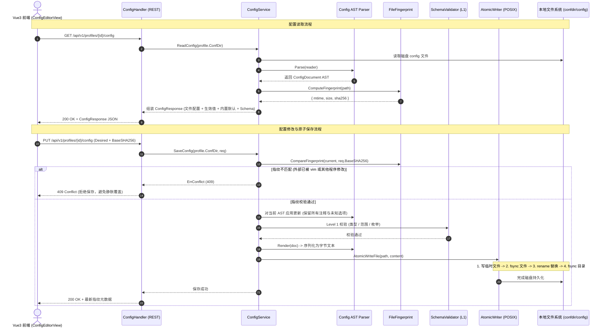
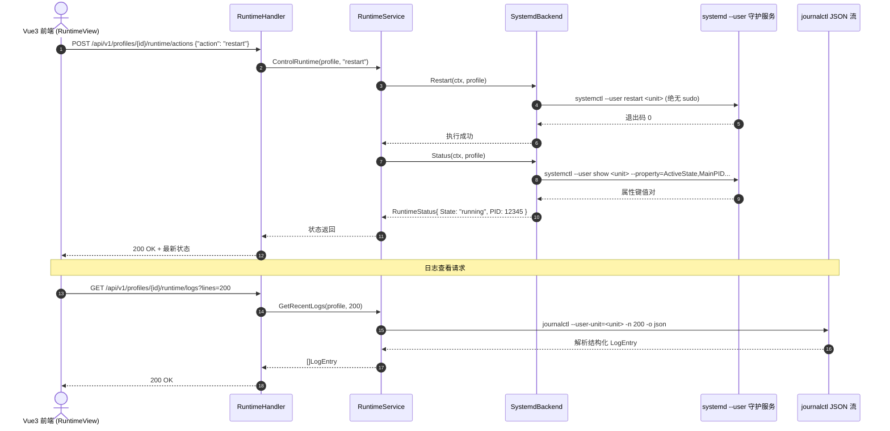
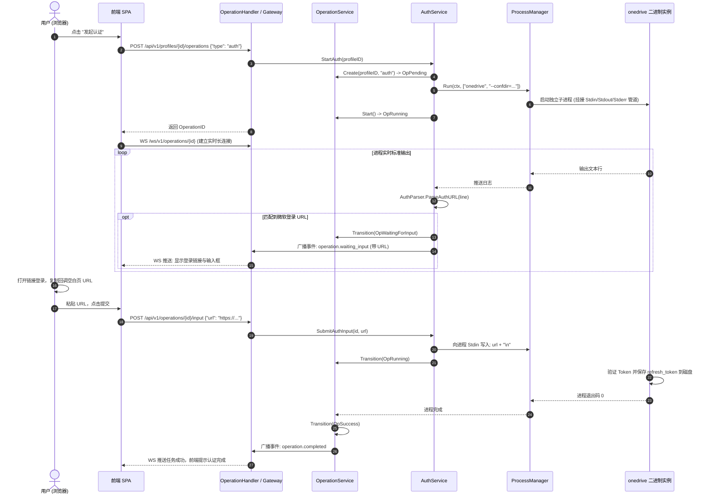

# OneWeb 代码地图与开发者维护手册 (Codebase Map & Developer Guide)

> **目标受众**：新加入项目的开发者、功能扩展者、Bug 排查人员与架构维护者。  
> **设计思想**：整洁架构（Clean Architecture）、单向依赖原则、领域模型（Domain）无外部侵入。

---

## 目录

- [1. 架构全景与依赖分层](#1-架构全景与依赖分层)
- [2. 代码仓库全貌地图 (Directory Map)](#2-代码仓库全貌地图-directory-map)
- [3. 核心领域模型与关键类型索引](#3-核心领域模型与关键类型索引)
- [4. 关键业务流程端到端链路 (End-to-End Traces)](#4-关键业务流程端到端链路-end-to-end-traces)
  - [4.1 配置读取与保存校验流水线 (Config Pipeline)](#41-配置读取与保存校验流水线-config-pipeline)
  - [4.2 运行时守护进程控制流水线 (Runtime Pipeline)](#42-运行时守护进程控制流水线-runtime-pipeline)
  - [4.3 异步 Operation 与交互式 OAuth 流水线 (Auth Pipeline)](#43-异步-operation-与交互式-oauth-流水线-auth-pipeline)
  - [4.4 SyncList 白名单规则编译与校验 (SyncList Pipeline)](#44-synclist-白名单规则编译与校验-synclist-pipeline)
- [5. 常见维护与二次开发场景 (How-To Guides)](#5-常见维护与二次开发场景-how-to-guides)
  - [5.1 场景一：如何添加一个新的配置选项 (Add Config Option)](#51-场景一如何添加一个新的配置选项-add-config-option)
  - [5.2 场景二：如何接入新的运行时后端 (Implement Runtime Backend)](#52-场景二如何接入新的运行时后端-implement-runtime-backend)
  - [5.3 场景三：如何排查配置 AST 往返保真度 Bug](#53-场景三如何排查配置-ast-往返保真度-bug)
  - [5.4 场景四：本地前后端联合开发与热调试](#54-场景四本地前后端联合开发与热调试)
- [6. 不可逾越的 7 条架构红线 (Architectural Invariants)](#6-不可逾越的-7-条架构红线-architectural-invariants)
- [7. 测试与质量保障体系](#7-测试与质量保障体系)

---

## 1. 架构全景与依赖分层

OneWeb 严格遵守 **整洁架构（Clean Architecture）** 四层规范：

```text
┌─────────────────────────────────────────────────────────────┐
│                    Presentation Layer                       │
│     Vue 3 + TypeScript + Vite + Tailwind CSS (SPA)          │
└──────────────────────────────┬──────────────────────────────┘
                               │ RESTful API / WebSocket
┌──────────────────────────────▼──────────────────────────────┐
│                         API Layer                           │
│           internal/api/rest  &  internal/api/websocket      │
└──────────────────────────────┬──────────────────────────────┘
                               │ DTO / Command / Query
┌──────────────────────────────▼──────────────────────────────┐
│                    Application Layer                        │
│                   internal/application/                     │
│   (ProfileService, ConfigService, RuntimeService, etc.)     │
└──────────────────────────────┬──────────────────────────────┘
                               │ Entities / Repositories Interfaces
┌──────────────────────────────▼──────────────────────────────┐
│                       Domain Layer                          │
│                     internal/domain/                        │
│   (Profile, Config AST, Operation, SyncRule, Capability)    │
└──────────────────────────────▲──────────────────────────────┘
                               │ Implements Interfaces
┌──────────────────────────────┴──────────────────────────────┐
│                   Infrastructure Layer                      │
│                  internal/infrastructure/                   │
│   (configparser, filesystem, onedrive, systemd, events)     │
└─────────────────────────────────────────────────────────────┘
```

### 依赖规则（Dependency Rule）
* **Domain 位于中心**：Domain 绝对不导入 Application、Infrastructure 或 API 包，不知道任何关于 HTTP、JSON Tag、Docker、WebSocket 或 Go Channel 的实现细节。
* **单向向下依赖**：API 依赖 Application；Application 依赖 Domain 及 Infrastructure 抽象接口；Infrastructure 实现 Domain / Application 声明的接口。

---

## 2. 代码仓库全貌地图 (Directory Map)

```text
oneweb/
├── cmd/
│   └── oneweb/
│       └── main.go                     # 主入口：命令行 Flag 解析、依赖注入 (DI)、平滑退出
├── internal/
│   ├── domain/                         # 领域层：纯粹的业务实体与抽象规约
│   │   ├── profile/profile.go          # Profile 聚合根，运行时类型定义，Repository 接口
│   │   ├── config/ast.go               # 配置 AST 语法树结构 (NodeKeyValue, Comment, etc.)
│   │   ├── config/schema.go            # 配置项语义 Schema 结构与校验规则定义
│   │   ├── runtime/backend.go          # RuntimeBackend 核心接口抽象与 RuntimeStatus 模型
│   │   ├── operation/operation.go      # 异步操作状态机，合法跃迁判定与终端态不可变约束
│   │   ├── sync/rule.go                # SyncRule 白名单规则对象与 SyncRuleSet
│   │   ├── capability/version.go       # 客户端 SemVer 解析与兼容性特性矩阵
│   │   └── event.go                    # 统一领域事件模型 DomainEvent
│   ├── application/                    # 应用服务层：用例编排与跨基础设施事务控制
│   │   ├── profile_service.go          # Profile CRUD 编排，环境自检
│   │   ├── config_service.go           # 配置读取对比（文件/生效/默认）、沙箱验证、原子写入
│   │   ├── runtime_service.go          # 守护进程启停路由分发、状态聚合
│   │   ├── operation_service.go        # 异步工作单元生命周期、子进程挂接、事件发布
│   │   ├── auth_service.go             # 交互式 OAuth 登录会话管理与终端管道写入
│   │   └── sync_service.go             # SyncList 解析、语法校验与 Resync 预警联动
│   ├── infrastructure/                 # 基础设施层：具体外部系统对接与技术实现
│   │   ├── filesystem/
│   │   │   ├── atomic_writer.go        # POSIX 临时文件 -> fsync -> rename -> dir fsync 原子写入
│   │   │   ├── fingerprint.go          # 文件的 mtime + size + SHA256 指纹检测
│   │   │   └── profile_store.go        # ~/.config/oneweb/profiles.json 持久化实现
│   │   ├── configparser/
│   │   │   ├── lexer.go                # 行级词法分析器（支持注释、空行、行内注释、BOM）
│   │   │   ├── parser.go               # 语法分析生成 ConfigDocument AST
│   │   │   ├── renderer.go             # AST 文本反序列化（严格保持原始排版与注释）
│   │   │   ├── schema_loader.go        # 内嵌 JSON 语义 Schema 反序列化
│   │   │   ├── validator.go            # 静态 Level 1 Schema 校验器（类型、范围、枚举）
│   │   │   ├── synclist_parser.go      # sync_list 白名单规则文件解析器
│   │   │   ├── synclist_compiler.go    # SyncRuleSet 重新编译为标准规则文本
│   │   │   ├── synclist_validator.go   # 规则前导斜杠检查与 Performance 预警算法
│   │   │   └── synclist_matcher.go     # 规则判定引擎（Allow-list + 排除覆盖语义实现）
│   │   ├── onedrive/
│   │   │   ├── cli.go                  # onedrive CLI 子进程封装 (--display-config 等)
│   │   │   ├── process.go              # 支持交互式 Stdin/Stdout/Stderr 管道的进程管理器
│   │   │   ├── auth_parser.go          # 正则捕获 CLI 输出中的 Microsoft OAuth / Device URL
│   │   │   ├── version.go              # onedrive --version 探针与版本提取
│   │   │   └── signal_linux.go         # Linux 进程组 SIGTERM / SIGKILL 信号优雅中断
│   │   ├── runtime/
│   │   │   └── systemd/
│   │   │       ├── backend.go          # systemctl --user 状态提取与启停控制
│   │   │       └── linger.go           # loginctl 探测当前用户 Linger 挂载状态
│   │   ├── journal/
│   │   │   └── streamer.go             # journalctl --user-unit JSON 格式流式监听管道
│   │   └── events/
│   │       └── bus.go                  # 基于 Goroutine Channel 的非阻塞内存事件总线
│   └── api/                            # 接入层：HTTP REST 与 WebSocket 网关
│       ├── rest/
│       │   ├── router.go               # chi 路由拓扑定义、中间件链挂载
│       │   ├── static.go               # embed.FS 静态文件服务与 SPA 路径回退兜底
│       │   ├── helpers.go              # JSON 响应格式化与统一错误输出
│       │   ├── system_handler.go       # GET /api/v1/system/*
│       │   ├── profile_handler.go      # /api/v1/profiles/* CRUD
│       │   ├── config_handler.go       # GET/PUT /api/v1/profiles/{id}/config
│       │   ├── runtime_handler.go      # GET/POST /api/v1/profiles/{id}/runtime/*
│       │   ├── operation_handler.go    # 异步操作创建、查询、取消与输入注入
│       │   └── synclist_handler.go     # GET/PUT /api/v1/profiles/{id}/sync-list
│       └── websocket/
│           └── gateway.go              # nhooyr.io/websocket 升级，多端广播操作日志帧
├── schema/
│   ├── onedrive/
│   │   ├── semantic/v2.5.json          # 官方全部 40+ 配置项元数据（类型、约束、默认值）
│   │   └── ui/v2.5.json                # 前端组件形态（switch, slider, input）、分组排序
│   └── embed.go                        # //go:embed 打包 schema
├── web/                                # 前端工程 (Vue 3 + Vite + TypeScript)
│   ├── src/
│   │   ├── api/                        # 对应后端的 Axios / Fetch 接口客户端
│   │   ├── stores/                     # Pinia 状态树 (profileStore, configStore)
│   │   ├── views/                      # 核心视图 (Dashboard, ConfigEditor, Runtime, SyncList)
│   │   ├── components/                 # SchemaForm 动态表单、LogViewer 终端、StatusBadge
│   │   └── router/index.ts             # 前端 SPA 路由
├── packaging/                          # 交付打包资产
│   ├── systemd/oneweb.service          # User-level Systemd 模板
│   └── docker/                         # Dockerfile 与 docker-compose 编排
├── tests/
│   ├── fixtures/config/                # 12 种典型/异常 config 测试样本
│   └── fixtures/synclist/              # 8 种白名单规则测试样本
├── Makefile                            # 构建、测试、打包、安装自动化目标
├── go.mod                              # Go 模块定义
└── README.md                           # 项目入口说明
```

---

## 3. 核心领域模型与关键类型索引

| 类型名称 | 源码定义位置 | 职责说明 |
| :--- | :--- | :--- |
| `Profile` | `internal/domain/profile/profile.go` | 描述 OneDrive 运行实例的映射元数据（ID、显示名、ConfDir、Runtime 目标）。**严禁包含 `sync_dir`**。 |
| `ConfigNode` | `internal/domain/config/ast.go` | 配置 AST 最小节点，保留原始文本、键、值、行内注释及行号。 |
| `ConfigDocument` | `internal/domain/config/ast.go` | 抽象语法树容器，支持按 Key 查询、设置、启用或注销配置项。 |
| `OptionSchema` | `internal/domain/config/schema.go` | 定义单个配置项的语义规则（类型、默认值、上下限范围、枚举候选）。 |
| `RuntimeBackend` | `internal/domain/runtime/backend.go` | 运行时统一适配接口（`Detect`, `Start`, `Stop`, `Restart`, `Status`, `Logs`）。 |
| `Operation` | `internal/domain/operation/operation.go` | 异步工作单元聚合根，通过 `Transition()` 方法驱动严格的 9 状态生命周期。 |
| `SyncRule` | `internal/domain/sync/rule.go` | 结构化表示包含（Include）或排除（Exclude）规则及其根路径归属。 |
| `DomainEvent` | `internal/domain/event.go` | 领域内部事件流，解耦业务逻辑与 WebSocket 推送。 |

---

## 4. 关键业务流程端到端链路 (End-to-End Traces)

### 4.1 配置读取与保存校验流水线 (Config Pipeline)



---

### 4.2 运行时守护进程控制流水线 (Runtime Pipeline)



---

### 4.3 异步 Operation 与交互式 OAuth 流水线 (Auth Pipeline)



---

### 4.4 SyncList 白名单规则编译与校验 (SyncList Pipeline)

1. **输入阶段**：用户提交修改后的规则文本或在文件树中勾选。
2. **语法分析 (`synclist_parser.go`)**：
   - 区分空行、注释（`#`）、排除项（`!` 或 `-`）、包含项（普通行）。
   - 解析是否包含前导 `/`（即 `IsRooted`）。
3. **安全校验 (`synclist_validator.go`)**：
   - 若某行包含规则未带前导 `/`（如 `Documents`）：
     - 计算其潜在性能影响，产生 **Performance Warning**：“该规则在整个目录树无根递归匹配，可能引起严重的 CPU 与磁盘扫描开销”。
   - 检查规则顺序：若排除规则定义晚于包含规则，发出提示。
4. **决策判定 (`synclist_matcher.go`)**：
   - 依据 Allow-list 语义：默认拒绝全部。
   - 自上而下逐条计算，支持通配符 `*` 与多级跨层 `**`。
5. **持久化与提醒**：
   - 调用 `AtomicWriteFile` 写入 `confdir/sync_list`。
   - 强制在 API 响应中回传 `requires_resync: true`，促使前端弹窗建议用户执行全量重同步。

---

## 5. 常见维护与二次开发场景 (How-To Guides)

### 5.1 场景一：如何添加一个新的配置选项 (Add Config Option)

当官方 `abraunegg/onedrive` 升级并引入了新的配置参数（例如 `new_cool_feature`）：

1. **更新语义定义**：编辑 [`schema/onedrive/semantic/v2.5.json`](file:///home/yeecean/coding-space/oneweb/schema/onedrive/semantic/v2.5.json)，在 `options` 数组增加项：
   ```json
   {
     "key": "new_cool_feature",
     "type": "bool",
     "default": false,
     "description": "启用某项全新同步特性",
     "group": "advanced"
   }
   ```
2. **更新 UI 元数据**：编辑 [`schema/onedrive/ui/v2.5.json`](file:///home/yeecean/coding-space/oneweb/schema/onedrive/ui/v2.5.json)，指定该配置的展现控件：
   ```json
   "new_cool_feature": {
     "widget": "switch",
     "advanced": true
   }
   ```
3. **验证与生效**：
   - 重新执行 `go test ./internal/infrastructure/configparser/...` 确保 Schema 加载测试通过。
   - 无需编写任何 Go 业务逻辑或修改 Vue 页面，前端 **SchemaForm** 组件会自动读取 Schema，并在高级设置组中渲染出对应的开关组件！

---

### 5.2 场景二：如何接入新的运行时后端 (Implement Runtime Backend)

如果需要将容器运行时支持完善（如接入 Docker Engine）：

1. 在 `internal/domain/profile/profile.go` 中，确认 `RuntimeType` 包含 `RuntimeDocker = "docker"`。
2. 在 `internal/infrastructure/runtime/docker/` 下实现 [`RuntimeBackend`](file:///home/yeecean/coding-space/oneweb/internal/domain/runtime/backend.go) 接口中定义的 6 个方法：
   - `Detect(ctx)`
   - `Start(ctx, profile)`
   - `Stop(ctx, profile)`
   - `Restart(ctx, profile)`
   - `Status(ctx, profile)`
   - `Logs(ctx, profile, opts)`
3. 在 `cmd/oneweb/main.go` 中，将实现实例注册到 `RuntimeService`：
   ```go
   runtimeSvc := application.NewRuntimeService(map[profile.RuntimeType]runtime.RuntimeBackend{
       profile.RuntimeSystemd: systemdBackend,
       profile.RuntimeDocker:  dockerBackend,
   })
   ```
4. 运行现有的 `internal/application/runtime_service_test.go` 保证接口行为符合预期。

---

### 5.3 场景三：如何排查配置 AST 往返保真度 Bug

如果用户报告某种特定写法的 `config` 文件被 OneWeb 保存后丢失了某些内容：

1. **创建重现测试用例**：
   在 `tests/fixtures/config/` 下新增一个最小复现样本文件，例如 `bug_sample.conf`。
2. **执行往返单测**：
   在 `internal/infrastructure/configparser/renderer_test.go` 中运行：
   ```bash
   go test -v ./internal/infrastructure/configparser -run TestRoundTrip
   ```
3. **定位环节**：
   - 若词法分析阶段漏分类：排查 `lexer.go` 中的正则与状态切分。
   - 若语法树漏保留行属性：检查 `ast.go` 中 `ConfigNode` 的原始字符串存储。
   - 若序列化格式漂移：检查 `renderer.go` 中各节点的拼接换行逻辑。

---

### 5.4 场景四：本地前后端联合开发与热调试

在日常开发过程中，不需要每次都执行完整的 `make build`：

1. **终端 1（启动后端 API 服务）**：
   ```bash
   cd /home/yeecean/coding-space/oneweb
   go run ./cmd/oneweb -listen 127.0.0.1:8080
   ```
2. **终端 2（启动前端 Vite 开发服务器）**：
   ```bash
   cd /home/yeecean/coding-space/oneweb/web
   npm run dev
   ```
3. **开发热重载机制**：
   - Vite 启动在 `http://localhost:5173`，其配置中已内置针对 `/api` 和 `/ws` 到 `http://localhost:8080` 的自动反向代理。
   - 修改 Vue 组件时，页面瞬间热更新（HMR）；修改后端代码时只需重启终端 1 中的 `go run` 进程。

---

## 6. 不可逾越的 7 条架构红线 (Architectural Invariants)

在 Code Review、Issue 处理和功能重构中，任何违反以下 7 条红线的 Pull Request 必须予以否决：

| 编号 | 红线规则 | 核心原因与后果 |
| :---: | :--- | :--- |
| **1** | **绝对不自研同步引擎** | 严禁通过 Microsoft Graph 直接读写云端文件、分块传输。OneWeb 仅为控制面。 |
| **2** | **事实来源唯一性 (SSOT)** | `config` / `sync_list` 是可读写事实源；`items.sqlite3` 严格只读，严禁 `UPDATE/DELETE/ALTER`。 |
| **3** | **配置数据零冗余持久化** | `Profile` 元数据中严禁存储 `sync_dir`、`threads` 等参数，这些必须实时回溯底层配置文件。 |
| **4** | **配置 AST 必须 100% 无损** | 配置保存绝不能抹杀用户的注释行、空行、格式，必须原样保留未知超前字段。 |
| **5** | **运行时绝对抽象** | 严禁在 API Handler 或 Application 层直接调用 `exec.Command("systemctl")`，必须经由 `RuntimeBackend`。 |
| **6** | **耗时任务必须 Operation 化** | 任何耗时超过 500ms 的外部动作（同步、认证、Dry Run）必须走异步状态机与 WebSocket 推送。 |
| **7** | **SyncList 模型单一性** | 可视化文件树视图与高级文本编辑器必须双向映射到同一个 `SyncRuleSet`，严禁两套割裂逻辑。 |

---

## 7. 测试与质量保障体系

### 运行全套单元测试
```bash
make test
# 或
go test ./... -v -count=1
```

### 关键测试覆盖包一览
- `internal/infrastructure/configparser`: 覆盖 12 个样本的 AST Round-trip、修改、Level 1 Schema 校验、SyncList 规则语义。
- `internal/infrastructure/filesystem`: 验证原子写入中断恢复、SHA256 指纹比对、ProfileStore 存储。
- `internal/domain/operation`: 验证 9 种状态机的全部合法跃迁与终端态不可变约束。
- `internal/infrastructure/onedrive`: 验证 OAuth 认证 URL 正则提取与进程取消信号响应。
- `internal/api/websocket`: 验证多连接并发订阅与日志事件推送。
