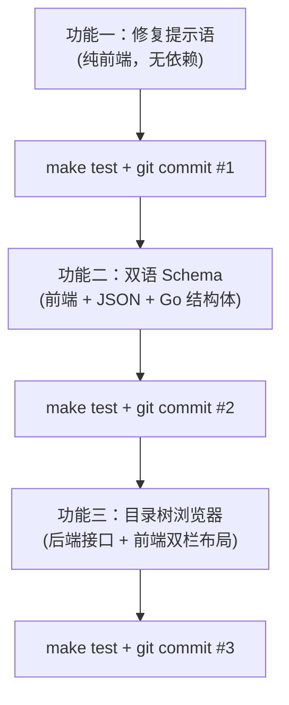

# OneWeb 三项功能实现计划

## 目标描述

本计划针对 OneWeb 项目的三项功能改进，每项完成后都进行自动化测试、`git commit` 与远端推送：

1. **修复配置管理时「配置文件尚不存在」提示语**
2. **配置管理界面中英文双语支持（Schema 描述双语化）**
3. **选择性同步界面添加云端文件夹与本地目录树浏览器**

> [!NOTE]
> 本计划中所有代码变更都已对照现有架构（Clean Architecture 五层红线）进行设计，严格遵循后端分层：`domain → infrastructure → application → rest → frontend`，无任何违规直接调用。

---

## 问题背景与根因

### 问题 1：「配置文件尚不存在」提示语

**现象**：进入配置管理页面，保存栏底部始终显示灰色提示 `「配置文件尚不存在，保存将创建」`。

**根因**：当用户 `~/.config/onedrive/` 目录中没有 `config` 文件时（只有 `items.sqlite3`、`refresh_token` 等），后端 `ReadConfig()` 在 `os.Stat(path)` 检测不到文件时返回 `FileExists: false`。前端 [`ConfigEditorView.vue`](file:///home/yeecean/coding-space/oneweb/web/src/views/ConfigEditorView.vue#L112) 第 112-115 行直接将此作为警告提示显示，造成用户困惑——因为：
- 这其实是一个**正常可编辑状态**（全默认值已加载，可以正常保存）
- 该提示语传达了一种「文件缺失/错误」的负面语义，实际上保存会正常创建文件，并不是错误

**修复策略**：将该提示从「警告式」改为「信息引导式」，更改措辞并升级 UI 样式，不再令用户困惑。

---

### 问题 2：配置管理中英文双语

**现象**：Schema 表单中所有配置项的 `description` 字段（如 `"Directory where files will be synced"`）均为英文，非英语母语用户看不懂含义。

**当前架构**：
- Schema 描述存放在 [`schema/onedrive/semantic/v2.5.json`](file:///home/yeecean/coding-space/oneweb/schema/onedrive/semantic/v2.5.json) 中，字段为 `description`（纯英文）
- UI 分组配置在 [`schema/onedrive/ui/v2.5.json`](file:///home/yeecean/coding-space/oneweb/schema/onedrive/ui/v2.5.json) 中，分组标签已是中文（如 `"同步设置"`）
- 前端 [`SchemaForm.vue`](file:///home/yeecean/coding-space/oneweb/web/src/components/config/SchemaForm.vue#L80) 直接渲染 `opt.description`

**双语化方案**：在 `semantic` schema 的每个 option 中扩展 `description_zh` 字段，前端根据当前语言优先显示中文，兼容英文回退。不引入 i18n 框架，保持轻量。

---

### 问题 3：选择性同步界面显示云端/本地目录树

**现象**：当前 [`SyncListView.vue`](file:///home/yeecean/coding-space/oneweb/web/src/views/SyncListView.vue) 仅提供一个纯文本编辑框，用户需要手动输入路径规则（如 `/Documents/*`），但：
- 用户不清楚 OneDrive 上有哪些文件夹
- 规则语法不直观（需要知道前缀 `/`、`!` 的含义）

**目标**：在编辑框旁边增加一个「目录浏览器」面板，显示本地已同步的目录结构，用户可以勾选文件夹，自动生成对应的 sync_list 规则。

**数据来源策略**：
- 扫描本地 `sync_dir`（默认 `~/OneDrive`）已有的目录树（不依赖网络，实时可用）
- 作为**第二选项**：若后端可在不阻塞的情况下调用 `onedrive --display-sync-status`，可展示云端剩余条目（可选扩展）

> [!IMPORTANT]
> 由于直接调用 OneDrive API 获取云端目录树需要网络，且容易超时（已观察到 `display-sync-status` 需要约 5 秒），**主要实现以本地目录树扫描为主**，云端部分作为可选的渐进增强。

---

## Open Questions

> [!NOTE]
> 以下问题不影响实现推进，实现中按建议默认方案执行。

1. **双语语言切换方式**：是全局切换（加语言选择按钮）还是每个 option 同时显示中英文双行？→ 建议：同时显示中英文双行（中文加粗在上，英文灰色在下），不加切换按钮，最简洁。
2. **目录树扫描深度**：是否限制层级？→ 建议：最多 3 层目录深度，避免大目录卡顿。
3. **sync_list 规则生成逻辑**：勾选一个文件夹时，生成 `/文件夹名/*`（同步该文件夹的全部内容）还是 `/文件夹名`？→ 建议：生成 `/文件夹名` 形式（onedrive 客户端会递归同步），并在界面上提供说明。

---

## 功能一：修复「配置文件尚不存在」提示语

### 变更范围

#### [MODIFY] `ConfigEditorView.vue`
[`web/src/views/ConfigEditorView.vue`](file:///home/yeecean/coding-space/oneweb/web/src/views/ConfigEditorView.vue) 第 111-118 行

**变更前**（原始代码）：
```html
<div class="save-bar">
  <span v-if="configStore.config.file_exists" class="meta">
    指纹 {{ baseSha.slice(0, 12) }}… · 最近修改 {{ new Date(...).toLocaleString() }}
  </span>
  <span v-else class="meta">配置文件尚不存在，保存将创建</span>
  <button class="btn primary" :disabled="saving" @click="doSave">
    {{ saving ? '保存中...' : '保存配置' }}
  </button>
</div>
```

**变更后**（修改后）：
```html
<div class="save-bar">
  <span v-if="configStore.config.file_exists" class="meta">
    指纹 {{ baseSha.slice(0, 12) }}… · 最近修改 {{ new Date(...).toLocaleString() }}
  </span>
  <span v-else class="meta new-config-hint">
    📄 使用全默认值初始化配置文件——点击保存后将自动创建 <code>config</code> 文件
  </span>
  <button class="btn primary" :disabled="saving" @click="doSave">
    {{ saving ? '保存中...' : (configStore.config.file_exists ? '保存配置' : '创建并保存') }}
  </button>
</div>
```

同时在 `<style scoped>` 中新增：
```css
.new-config-hint {
  color: #0369a1;
  background: #e0f2fe;
  border: 1px solid #bae6fd;
  border-radius: 6px;
  padding: 5px 12px;
  font-size: 12px;
}
.new-config-hint code {
  background: #bae6fd;
  padding: 2px 4px;
  border-radius: 3px;
}
```

#### 无后端改动
问题纯前端视觉与措辞修复，后端逻辑不变（`file_exists: false` 是正确的）。

---

### 验证计划（功能一）

#### 自动化测试
```bash
# 编译前端确保无 TypeScript/编译错误
cd web && npm run build
# 全量后端单元测试
cd .. && make test
```

#### 手动验证
1. 确保 `~/.config/onedrive/config` 文件不存在（已确认）
2. 打开 `http://localhost:8080`，进入「配置管理」
3. **验证**：底部不再显示警告式红/灰文本，而是蓝色信息横幅 `📄 使用全默认值初始化...`
4. **验证**：保存按钮文字改为 `创建并保存`
5. 点击保存，确认文件被正确创建，随后提示变为 `指纹 xxx...`

#### Git 操作
```bash
git add web/src/views/ConfigEditorView.vue
git commit -m "fix: improve config-not-exists hint from warning to informational banner with accurate wording"
git push origin main
```

---

## 功能二：配置管理中英文双语

### 变更范围

#### [MODIFY] `schema/onedrive/semantic/v2.5.json`
为每个 `option` 增加 `description_zh` 字段，提供中文翻译。

示例 diff（仅展示前 5 个 option）：
```diff
  {
    "key": "sync_dir",
    "type": "path",
    "default": "~/OneDrive",
    "description": "Directory where files will be synced",
+   "description_zh": "同步目录路径（OneDrive 文件将下载到此本地目录）",
    "group": "sync"
  },
  {
    "key": "skip_dir",
    "type": "string",
    "default": "~/.local/share/onedrive",
    "description": "Directories to skip during synchronization",
+   "description_zh": "同步时跳过的目录（支持通配符，多个目录用 | 分隔）",
    "group": "sync"
  },
  {
    "key": "skip_file",
    "type": "string",
    "default": "~*.tmp",
    "description": "Files to skip during synchronization",
+   "description_zh": "同步时跳过的文件（支持通配符，多个文件用 | 分隔）",
    "group": "sync"
  },
  {
    "key": "skip_dotfiles",
    "type": "bool",
    "default": false,
    "description": "Skip dot files and folders from synchronization",
+   "description_zh": "跳过以点（.）开头的隐藏文件和文件夹",
    "group": "sync"
  },
  {
    "key": "monitor_interval",
    "type": "integer",
    "default": "300",
    "description": "Number of seconds between monitor mode sync operations",
+   "description_zh": "后台守护模式下每次同步的间隔时间（秒），默认 300 秒（5 分钟）",
    "group": "performance"
  }
```

**完整翻译列表**（所有 option 均需提供，以下为全部关键项）：

| key | description_zh |
|-----|----------------|
| `sync_dir` | 同步目录路径（OneDrive 文件将下载到此本地目录） |
| `skip_dir` | 同步时跳过的目录（支持通配符，多个用 \| 分隔） |
| `skip_file` | 同步时跳过的文件（支持通配符，多个用 \| 分隔） |
| `skip_dotfiles` | 是否跳过以 . 开头的隐藏文件和文件夹 |
| `skip_symlinks` | 是否跳过符号链接文件 |
| `sync_root_files` | 是否同步 OneDrive 根目录下的文件 |
| `classify_as_big_delete` | 触发「大量删除」保护机制的文件数量阈值 |
| `sync_business_shared_folders` | 要同步的 OneDrive 商业版共享文件夹（逗号分隔） |
| `sync_business_shared_items` | 要同步的 OneDrive 商业版共享条目（逗号分隔） |
| `webhook_enabled` | 是否启用 Webhook 以实时检测本地文件变动 |
| `webhook_expiration_interval` | Webhook 订阅过期时间间隔 |
| `webhook_ping_interval` | Webhook 心跳间隔（秒） |
| `webhook_timeout` | Webhook 响应超时时间（秒） |
| `monitor_interval` | 后台监控模式同步间隔（秒，默认 300） |
| `min_notify_changes` | 触发同步通知的最小变更文件数 |
| `log_frequency` | 监控模式下日志输出频率（秒） |
| `verbose` | 是否开启详细日志输出（调试用） |
| `debug_https` | 是否调试 HTTPS 通信内容 |
| `debug_httpx` | 是否调试 HTTP/X 通信内容 |
| `disable_notifications` | 是否禁用桌面通知 |
| `disable_upload_validation` | 是否禁用上传文件完整性校验 |
| `enable_logging` | 是否将运行日志写入独立日志文件 |
| `force_http_11` | 强制使用 HTTP/1.1（遇到兼容性问题时使用） |
| `threads` | 并行上传/下载线程总数 |
| `upload_threads` | 并行上传线程数 |
| `download_threads` | 并行下载线程数 |
| `check_nomount` | 是否检查同步目录是否为挂载点 |
| `check_nosync` | 是否检查目录中的 .nosync 标记文件 |
| `cleanup_local_files` | 是否清理本地多余文件（仅限下载模式） |
| `disable_permission_validation` | 是否禁用文件权限校验 |
| `disable_upload_v2` | 是否禁用上传 v2 协议 |
| `disable_upload_v1` | 是否禁用上传 v1 协议 |
| `bypass_data_movement_worker` | 是否绕过数据移动 Worker |
| `dns_timeout` | DNS 解析超时时间（秒） |
| `connect_timeout` | TCP 连接超时时间（秒） |
| `http_response_timeout` | HTTP 响应超时时间（秒） |
| `local_first` | 是否优先上传本地文件后再下载云端文件 |
| `resync` | 是否执行完整重同步（忽略本地状态数据库） |
| `force_https` | 强制使用 HTTPS |
| `remove_source_files` | 上传后是否删除本地源文件（仅限上传模式） |
| `sync_dir_permissions` | 同步目录权限（八进制，如 755） |
| `sync_file_permissions` | 同步文件权限（八进制，如 644） |
| `sync_file_acl` | 是否同步 ACL 权限 |
| `sync_file_xattrs` | 是否同步扩展属性（xattrs） |
| `application_id` | 微软 Azure AD 应用程序 ID |
| `azure_ad_endpoint` | Azure AD 认证端点 URL |
| `azure_ad_tenant` | Azure AD 租户 ID |
| `client_id` | OAuth2 客户端 ID |
| `client_secret` | OAuth2 客户端密钥 |
| `configurable_auth` | 是否启用可配置的认证流程 |
| `use_device_auth` | 是否使用设备代码认证流程 |
| `use_intune_sso` | 是否使用 Intune SSO 认证 |
| `user_agent` | 自定义 HTTP User-Agent 头 |
| `usage_percent_threshold` | 磁盘使用率阈值（超出则停止同步） |

#### [MODIFY] `schema/onedrive/semantic/v2.5.json` 中的 OptionSchema 类型定义
Go 后端中对应的结构体需要扩展字段（以便正确序列化到前端）：

```go
// internal/domain/config/schema.go（或 configparser 中的 schema 结构体）
type OptionSchema struct {
    Key            string      `json:"key"`
    Type           string      `json:"type"`
    Default        interface{} `json:"default,omitempty"`
    Description    string      `json:"description,omitempty"`
    DescriptionZh  string      `json:"description_zh,omitempty"` // 新增
    MinVersion     string      `json:"min_version,omitempty"`
    Constraints    *Constraints `json:"constraints,omitempty"`
    Deprecated     bool        `json:"deprecated,omitempty"`
    Group          string      `json:"group,omitempty"`
}
```

> [!NOTE]
> 需要先找到后端当前定义 `OptionSchema` 的文件位置，在对应 Go 结构体中添加 `DescriptionZh` 字段，确保 JSON tag 为 `description_zh`。

#### [MODIFY] `web/src/api/config.ts`
扩展 TypeScript 接口：
```typescript
export interface OptionSchema {
  key: string
  type: string
  default?: any
  description?: string
  description_zh?: string  // 新增
  // ... 其余字段不变
}
```

#### [MODIFY] `web/src/components/config/SchemaForm.vue`
将描述渲染改为中英文双语显示：

**变更前**：
```html
<p class="option-desc">{{ opt.description }}</p>
```

**变更后**：
```html
<p class="option-desc">
  <span v-if="opt.description_zh" class="desc-zh">{{ opt.description_zh }}</span>
  <span class="desc-en" :class="{ 'with-zh': opt.description_zh }">
    {{ opt.description }}
  </span>
</p>
```

对应 CSS：
```css
.desc-zh {
  display: block;
  font-weight: 500;
  color: #334155;
  margin-bottom: 2px;
}
.desc-en {
  display: block;
  color: #94a3b8;
  font-size: 11px;
}
.desc-en.with-zh {
  /* 英文放在中文下方，较小字号 */
  font-size: 11px;
}
```

---

### 验证计划（功能二）

#### 自动化测试
```bash
# 确认 JSON schema 格式正确
python3 -c "import json; json.load(open('schema/onedrive/semantic/v2.5.json')); print('Schema JSON valid')"
# 后端单元测试（确保 schema 解析不报错）
go test ./internal/infrastructure/configparser/... -v
# 前端构建
cd web && npm run build
```

#### 手动验证
1. 打开 `http://localhost:8080`，进入「配置管理」→「Schema 表单」
2. **验证**：每个配置项都显示中文描述（加粗）+ 英文描述（灰色小字）
3. **验证**：分组标题仍然正确（同步设置、认证设置等）

#### Git 操作
```bash
git add schema/onedrive/semantic/v2.5.json \
        web/src/api/config.ts \
        web/src/components/config/SchemaForm.vue
# 如需修改 Go 结构体，额外 add 对应 .go 文件
git commit -m "feat: add bilingual zh/en descriptions to schema options in config form"
git push origin main
```

---

## 功能三：选择性同步界面添加本地目录树浏览器

### 整体架构设计

```mermaid
flowchart LR
    A["用户点击 SyncList 页面"] --> B["前端请求 GET /api/v1/profiles/id/sync-list/tree"]
    B --> C["后端 SyncListHandler.Tree()"]
    C --> D["application.SyncService.ScanLocalTree(confdir)"]
    D --> E["读取 config 中的 sync_dir 路径"]
    E --> F["扫描本地 ~/OneDrive 最多 3 层目录"]
    F --> G["返回 DirNode[] JSON 树"]
    G --> H["前端 TreeBrowser 组件渲染"]
    H --> I["用户勾选/取消文件夹"]
    I --> J["自动生成 sync_list 规则追加到编辑框"]
```



### 变更范围

#### [NEW] 后端：`DirNode` 结构与树扫描接口

**`internal/application/sync_service.go`** 中新增方法：

```go
// DirNode 表示目录树的一个节点。
type DirNode struct {
    Name     string    `json:"name"`
    Path     string    `json:"path"`     // 相对于 sync_dir 的路径，如 /Documents
    IsDir    bool      `json:"is_dir"`
    Children []DirNode `json:"children,omitempty"`
}

// ScanLocalTree 扫描本地 sync_dir 目录树，最多 maxDepth 层。
// sync_dir 从配置文件读取，默认为 ~/OneDrive。
func (s *SyncService) ScanLocalTree(confdir string, maxDepth int) ([]DirNode, error) {
    // 1. 尝试从 config 文件读取 sync_dir，默认 ~/OneDrive
    syncDir := resolveSyncDir(confdir)
    // 2. 检查目录是否存在
    if _, err := os.Stat(syncDir); os.IsNotExist(err) {
        return []DirNode{}, nil
    }
    // 3. 递归扫描（BFS，只扫描目录，不扫描文件）
    return scanDir(syncDir, syncDir, 0, maxDepth)
}

// resolveSyncDir 读取 confdir/config 获取 sync_dir，失败则返回 ~/OneDrive
func resolveSyncDir(confdir string) string { ... }

// scanDir 递归扫描目录，路径使用相对于 baseDir 的格式
func scanDir(baseDir, currentDir string, depth, maxDepth int) ([]DirNode, error) {
    if depth >= maxDepth { return nil, nil }
    entries, _ := os.ReadDir(currentDir)
    var nodes []DirNode
    for _, e := range entries {
        if !e.IsDir() { continue }
        // 跳过隐藏目录
        if strings.HasPrefix(e.Name(), ".") { continue }
        relPath := strings.TrimPrefix(filepath.Join(currentDir, e.Name()), baseDir)
        children, _ := scanDir(baseDir, filepath.Join(currentDir, e.Name()), depth+1, maxDepth)
        nodes = append(nodes, DirNode{
            Name:     e.Name(),
            Path:     relPath,
            IsDir:    true,
            Children: children,
        })
    }
    return nodes, nil
}
```

#### [MODIFY] 后端：`SyncListHandler` 新增 `Tree` 端点

**`internal/api/rest/synclist_handler.go`** 新增：

```go
// Tree 处理 GET /api/v1/profiles/{id}/sync-list/tree
func (h *SyncListHandler) Tree(w http.ResponseWriter, r *http.Request) {
    p, err := h.Profiles.GetProfile(chi.URLParam(r, "profileID"))
    if err != nil {
        writeError(w, http.StatusNotFound, "NOT_FOUND", "profile not found", nil)
        return
    }
    maxDepth := 3 // 默认 3 层
    if d := r.URL.Query().Get("depth"); d != "" {
        if parsed, err := strconv.Atoi(d); err == nil && parsed > 0 && parsed <= 5 {
            maxDepth = parsed
        }
    }
    nodes, err := h.Sync.ScanLocalTree(p.ConfDir, maxDepth)
    if err != nil {
        writeError(w, http.StatusInternalServerError, "INTERNAL", err.Error(), nil)
        return
    }
    writeJSON(w, http.StatusOK, map[string]interface{}{"tree": nodes})
}
```

#### [MODIFY] 后端：路由注册

**`internal/api/rest/router.go`** 中新增路由：
```go
r.Get("/sync-list", syncH.Get)
r.Put("/sync-list", syncH.Put)
r.Get("/sync-list/tree", syncH.Tree)  // 新增
```

#### [NEW] 前端：`web/src/api/synclist.ts` 新增接口

```typescript
export interface DirNode {
  name: string
  path: string       // 相对路径，如 /Documents
  is_dir: boolean
  children?: DirNode[]
}

export async function getSyncListTree(profileId: string, depth = 3): Promise<DirNode[]> {
  const { data } = await client.get(`/profiles/${profileId}/sync-list/tree?depth=${depth}`)
  return data?.tree || []
}
```

#### [NEW] 前端：`web/src/components/sync/DirTreeBrowser.vue`

这是核心新组件，提供目录树浏览与规则生成功能：

```vue
<script setup lang="ts">
import { ref, computed } from 'vue'
import type { DirNode } from '@/api/synclist'

const props = defineProps<{
  nodes: DirNode[]
  loading: boolean
}>()

const emit = defineEmits<{
  (e: 'add-rule', rule: string): void
}>()

// 展开状态
const expanded = ref<Set<string>>(new Set())

function toggle(path: string) {
  if (expanded.value.has(path)) expanded.value.delete(path)
  else expanded.value.add(path)
}

function addInclude(node: DirNode) {
  // 生成 include 规则：/文件夹名
  emit('add-rule', node.path)
}

function addExclude(node: DirNode) {
  // 生成 exclude 规则：!/文件夹名
  emit('add-rule', `!${node.path}`)
}
</script>

<template>
  <div class="tree-browser">
    <div v-if="loading" class="tree-loading">扫描本地目录中...</div>
    <div v-else-if="nodes.length === 0" class="tree-empty">
      未发现本地 OneDrive 目录，服务运行后将自动同步文件
    </div>
    <div v-else class="tree-hint">
      点击 <kbd>+包含</kbd> 或 <kbd>−排除</kbd> 将文件夹快速添加到规则
    </div>
    <DirTreeNode
      v-for="node in nodes"
      :key="node.path"
      :node="node"
      :expanded="expanded"
      @toggle="toggle"
      @add-include="addInclude"
      @add-exclude="addExclude"
    />
  </div>
</template>
```

#### [NEW] 前端：`web/src/components/sync/DirTreeNode.vue`（递归子组件）

```vue
<script setup lang="ts">
import { computed } from 'vue'
import type { DirNode } from '@/api/synclist'

const props = defineProps<{
  node: DirNode
  expanded: Set<string>
  depth?: number
}>()

const emit = defineEmits<{
  (e: 'toggle', path: string): void
  (e: 'add-include', node: DirNode): void
  (e: 'add-exclude', node: DirNode): void
}>()

const isOpen = computed(() => props.expanded.has(props.node.path))
const hasChildren = computed(() => (props.node.children?.length ?? 0) > 0)
</script>

<template>
  <div class="tree-node" :style="{ paddingLeft: `${(depth ?? 0) * 16}px` }">
    <div class="node-row">
      <button class="expand-btn" @click="$emit('toggle', node.path)" v-if="hasChildren">
        {{ isOpen ? '▾' : '▸' }}
      </button>
      <span v-else class="expand-placeholder"></span>
      <span class="folder-icon">📁</span>
      <span class="node-name">{{ node.name }}</span>
      <span class="node-path">{{ node.path }}</span>
      <div class="node-actions">
        <button class="action-btn include" @click="$emit('add-include', node)" title="添加为同步包含规则">
          + 包含
        </button>
        <button class="action-btn exclude" @click="$emit('add-exclude', node)" title="添加为排除规则">
          − 排除
        </button>
      </div>
    </div>
    <template v-if="isOpen && hasChildren">
      <DirTreeNode
        v-for="child in node.children"
        :key="child.path"
        :node="child"
        :expanded="expanded"
        :depth="(depth ?? 0) + 1"
        @toggle="$emit('toggle', $event)"
        @add-include="$emit('add-include', $event)"
        @add-exclude="$emit('add-exclude', $event)"
      />
    </template>
  </div>
</template>
```

#### [MODIFY] 前端：`SyncListView.vue` 集成目录树

整体布局改为左右双栏（宽屏下 3:2 比例，窄屏下堆叠）：

```vue
<!-- SyncListView.vue 模板部分结构调整 -->
<template>
  <div>
    <header class="page-head">
      <h1>选择性同步 (SyncList)</h1>
      <button class="btn primary" :disabled="saving" @click="doSave">
        {{ saving ? '保存中...' : '保存规则' }}
      </button>
    </header>
    
    <!-- 新增：规则格式说明横幅 -->
    <div class="rule-legend">
      <span class="legend-item include"><code>/路径</code> — 仅同步此路径</span>
      <span class="legend-item exclude"><code>!/路径</code> — 排除此路径</span>
      <span class="legend-item comment"><code>#注释</code> — 注释行，不生效</span>
    </div>

    <div v-if="loading" class="state">加载中...</div>
    <div v-else-if="error" class="error-banner">{{ error }}</div>
    
    <template v-else-if="data">
      <!-- 横幅提示 -->
      ...
      
      <!-- 新增：双栏布局 -->
      <div class="split-layout">
        <!-- 左栏：编辑器 -->
        <div class="editor-pane">
          <h3 class="pane-title">📝 规则编辑器</h3>
          <textarea v-model="source" class="editor" ...></textarea>
          <!-- 规则预览（保留现有） -->
          <div class="rules-preview" v-if="data.rules && data.rules.length">
            ...
          </div>
        </div>
        
        <!-- 右栏：目录树浏览器（新增） -->
        <div class="tree-pane">
          <div class="pane-header">
            <h3 class="pane-title">📂 本地目录浏览</h3>
            <button class="btn-icon" @click="loadTree" title="刷新目录树">🔄</button>
          </div>
          <p class="pane-desc">
            浏览已同步的本地目录，点击按钮可快速生成规则
          </p>
          <DirTreeBrowser
            :nodes="treeNodes"
            :loading="treeLoading"
            @add-rule="appendRule"
          />
        </div>
      </div>
    </template>
  </div>
</template>
```

新增 script 部分（追加到现有 script 中）：
```typescript
import { getSyncListTree } from '@/api/synclist'
import DirTreeBrowser from '@/components/sync/DirTreeBrowser.vue'
import type { DirNode } from '@/api/synclist'

const treeNodes = ref<DirNode[]>([])
const treeLoading = ref(false)

async function loadTree() {
  treeLoading.value = true
  try {
    treeNodes.value = await getSyncListTree(id.value, 3)
  } catch (e) {
    // 静默失败，树面板为空
  } finally {
    treeLoading.value = false
  }
}

// appendRule 将新规则添加到编辑器，避免重复
function appendRule(rule: string) {
  const existing = source.value.split('\n').map(l => l.trim())
  if (existing.includes(rule)) return  // 已存在
  source.value = source.value
    ? source.value.trimEnd() + '\n' + rule
    : rule
}

// 页面加载时同步请求目录树
onMounted(async () => {
  await load()
  loadTree()  // 异步加载，不阻塞主内容
})
```

布局 CSS（新增双栏样式）：
```css
.split-layout {
  display: grid;
  grid-template-columns: 3fr 2fr;
  gap: 20px;
  align-items: start;
}
@media (max-width: 900px) {
  .split-layout { grid-template-columns: 1fr; }
}
.editor-pane, .tree-pane {
  background: #fff;
  border: 1px solid var(--oneweb-border);
  border-radius: 10px;
  padding: 16px;
}
.pane-title {
  font-size: 14px;
  font-weight: 600;
  margin: 0 0 12px;
}
```

---

### 验证计划（功能三）

#### 自动化测试
```bash
# 后端单元测试（SyncService.ScanLocalTree）
go test ./internal/application/... -v -run TestSyncService
# 前端 TypeScript 构建检查
cd web && npm run build
# 全量测试
make test
```

#### 手动验证
1. 确保 `~/OneDrive` 目录中有子目录（已确认有：附件、Documents、Pictures 等）
2. 打开 `http://localhost:8080`，进入「选择性同步」
3. **验证**：页面右侧出现「本地目录浏览」面板，列出 `~/OneDrive` 下的文件夹
4. **验证**：点击 `▸` 展开后显示子文件夹
5. **验证**：点击「+ 包含」按钮，左侧编辑器自动追加规则（如 `/Documents`）
6. **验证**：点击「− 排除」按钮，追加 `!/Pictures`
7. **验证**：同一规则点击两次不会重复追加
8. **验证**：点击「保存规则」后规则正确写入文件

#### Git 操作
```bash
git add \
  internal/application/sync_service.go \
  internal/api/rest/synclist_handler.go \
  internal/api/rest/router.go \
  web/src/api/synclist.ts \
  web/src/components/sync/DirTreeBrowser.vue \
  web/src/components/sync/DirTreeNode.vue \
  web/src/views/SyncListView.vue
git commit -m "feat: add local directory tree browser to SyncList view for visual rule generation"
git push origin main
```

---

## 实现顺序与依赖关系



三项功能彼此独立，按顺序串行实现，每项完成后立即测试与提交。

---

## 文件变更汇总

| 文件 | 操作 | 功能 |
|------|------|------|
| `web/src/views/ConfigEditorView.vue` | MODIFY | 功能一 |
| `schema/onedrive/semantic/v2.5.json` | MODIFY | 功能二 |
| `web/src/api/config.ts` | MODIFY | 功能二 |
| `web/src/components/config/SchemaForm.vue` | MODIFY | 功能二 |
| `internal/domain/config/schema.go`（或对应文件） | MODIFY | 功能二 |
| `internal/application/sync_service.go` | MODIFY | 功能三 |
| `internal/api/rest/synclist_handler.go` | MODIFY | 功能三 |
| `internal/api/rest/router.go` | MODIFY | 功能三 |
| `web/src/api/synclist.ts` | MODIFY | 功能三 |
| `web/src/components/sync/DirTreeBrowser.vue` | NEW | 功能三 |
| `web/src/components/sync/DirTreeNode.vue` | NEW | 功能三 |
| `web/src/views/SyncListView.vue` | MODIFY | 功能三 |

---

## 注意事项与约束

> [!IMPORTANT]
> **架构红线遵守（Clean Architecture）**：
> - 后端目录树扫描必须通过 `SyncService`（应用层）调用，不能在 REST Handler 中直接调用 `os.ReadDir`
> - 后端不能引入网络调用（如直接查询 OneDrive API），只扫描本地文件系统
> - 前端不能绕过 REST API 直接访问系统

> [!WARNING]
> **功能三性能注意**：
> - 目录扫描最大深度限制为 3 层（可通过 `?depth=N` 调整，最大 5）
> - 隐藏目录（以 `.` 开头）自动跳过
> - 每次打开页面或点击刷新按钮才重新扫描，不自动轮询

> [!NOTE]
> **Go 结构体定位**：功能二中需要找到 `OptionSchema` 结构体的确切 Go 文件位置（可能在 `internal/domain/config/schema.go` 或 `internal/infrastructure/configparser/` 中），需要实现者在修改前先 `grep "OptionSchema" --include="*.go" -r .` 确认。
