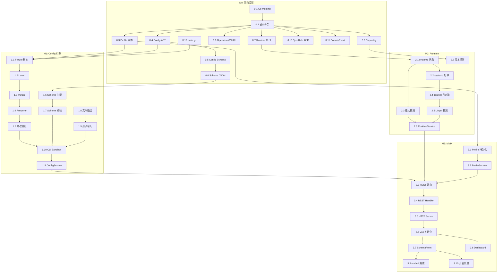

# OneWeb 逐步搭建计划 (Implementation Playbook)

> **基准文档**：[architecture.md](architecture.md) v4.0-FINAL
> **编写时间**：2026-09-13
> **执行原则**：自底向上，Domain → Infrastructure → Application → API → Web

---

## 总览：8 个里程碑 × 66 个可执行步骤


每个步骤标注：

| 标记 | 含义 |
| :--- | :--- |
| 📁 | 创建目录/文件 |
| 🧪 | 编写测试 |
| ✅ | 验收检查点 (Gate) |
| ⚠️ | 红线约束提醒 |

---

## M0 — 架构骨架与领域建模 (约 7 天)

> **目标**：建立可编译的 Go 工程骨架，定义全部 Domain 层类型与接口，Schema 元数据就绪。此阶段零业务逻辑实现，专注"把类型和边界定对"。

### Step 0.1 — Go 模块初始化

```bash
cd ~/coding-space/oneweb
go mod init github.com/yeecean/oneweb
```

📁 产出文件：
```
go.mod
go.sum
.gitignore          # Go + Node + IDE 通用模板
.editorconfig       # 统一缩进规范 (Go=tab, TS=2-space)
Makefile            # build / test / lint / fmt 基础目标
```

✅ 验收：`go build ./...` 零错误（此时还没有代码，但模块可解析）。

---

### Step 0.2 — 建立完整目录骨架

📁 创建所有规划中的空目录（用 `.gitkeep` 占位）：

```
cmd/oneweb/
internal/domain/profile/
internal/domain/config/
internal/domain/runtime/
internal/domain/operation/
internal/domain/sync/
internal/domain/capability/
internal/application/
internal/infrastructure/filesystem/
internal/infrastructure/configparser/
internal/infrastructure/onedrive/
internal/infrastructure/runtime/systemd/
internal/infrastructure/runtime/docker/
internal/infrastructure/journal/
internal/infrastructure/events/
internal/api/rest/
internal/api/websocket/
schema/onedrive/semantic/
schema/onedrive/ui/
web/
packaging/systemd/
packaging/docker/
packaging/deb/
tests/fixtures/config/
tests/fixtures/synclist/
tests/unit/
tests/integration/
docs/
```

✅ 验收：目录结构与 [architecture.md §13.2](architecture.md#132-目录结构布局规范) 完全一致。

---

### Step 0.3 — Profile 领域实体

📁 `internal/domain/profile/profile.go`

```go
// Package profile 定义 OneWeb 配置轮廓的核心领域实体。
// Profile 仅描述"如何找到和运行一个 OneDrive 配置"，
// 绝不持久化 sync_dir 等同步业务参数。
package profile
```

实现内容：
- `RuntimeType` 枚举常量 (`systemd` / `docker` / `podman`)
- `Profile` 结构体 (ID, DisplayName, ConfDir, RuntimeType, RuntimeTarget)
- `Validate()` 方法 — 校验 ID 格式（字母数字连字符）、ConfDir 非空
- `ProfileRepository` 接口 — `List`, `Get`, `Save`, `Delete`

⚠️ **红线 3**：结构体中严禁出现 `SyncDir`, `Threads` 等字段。

🧪 `internal/domain/profile/profile_test.go`：
- 空 ID 拒绝
- 包含特殊字符的 ID 拒绝
- 空 ConfDir 拒绝
- 合法 Profile 通过

---

### Step 0.4 — Config AST 领域模型

📁 `internal/domain/config/ast.go`

实现内容：
- `NodeType` 枚举 (KeyValue, DisabledKeyValue, Comment, BlankLine)
- `ConfigNode` 结构体 (Type, RawText, Key, Value, InlineComment, LineNumber)
- `ConfigDocument` 结构体 (Nodes 切片)
- `Get(key)` — 返回首个匹配的 KeyValue 节点
- `Set(key, value)` — 在已有节点上修改值，不存在则追加
- `Enable(key)` — 将 DisabledKeyValue 转为 KeyValue
- `Disable(key)` — 将 KeyValue 转为 DisabledKeyValue
- `Remove(key)` — 将 KeyValue 转为 Comment（保留记录，不真删）
- `Keys()` — 返回所有已启用的 key 列表

⚠️ **红线 4**：所有操作必须保留原始行号关联和未识别节点。

🧪 `internal/domain/config/ast_test.go`：
- Set 已有 key → 只改 value，行号不变
- Set 新 key → 追加到末尾
- Enable disabled key → 类型翻转
- Get 不存在的 key → 返回 nil
- Keys() 不返回 disabled 和 comment

---

### Step 0.5 — Config Schema 领域模型

📁 `internal/domain/config/schema.go`

```go
type ValueType string

const (
    TypeBool   ValueType = "bool"
    TypeInt    ValueType = "int"
    TypeString ValueType = "string"
    TypePath   ValueType = "path"
    TypeEnum   ValueType = "enum"
)

type OptionSchema struct {
    Key          string
    Type         ValueType
    Default      interface{}
    Description  string
    MinVersion   string        // 最低支持版本，如 "2.5.0"
    Constraints  *Constraints  // min/max/allowed_values
    Deprecated   bool
    Group        string        // "sync", "auth", "performance", "logging"
}

type Constraints struct {
    Min           *int
    Max           *int
    AllowedValues []string
}

type ConfigSchema struct {
    Options []OptionSchema
}
```

- `Validate(key, value)` — 根据 Schema 校验单个键值对
- `GetOption(key)` — 查找 Schema 定义
- `IsKnown(key)` — 判断是否为已知配置项

---

### Step 0.6 — Config Schema 元数据文件 (JSON)

📁 `schema/onedrive/semantic/v2.5.json`

这是整个配置引擎的数据基准。根据 `abraunegg/onedrive` 官方 `docs/application-config-options.md` 逐项提取：

```json
{
  "schema_version": "2.5",
  "min_client_version": "2.5.0",
  "options": [
    {
      "key": "sync_dir",
      "type": "path",
      "default": "~/OneDrive",
      "description": "Directory where files will be synced",
      "group": "sync",
      "constraints": {}
    },
    {
      "key": "sync_root_files",
      "type": "bool",
      "default": false,
      "description": "Sync files in the root of the OneDrive directory",
      "group": "sync"
    },
    {
      "key": "threads",
      "type": "int",
      "default": 8,
      "description": "Number of worker threads for uploads/downloads",
      "group": "performance",
      "constraints": { "min": 1, "max": 16 }
    }
  ]
}
```

> **完整列表需覆盖官方文档中全部约 40+ 配置项**。这里仅为示意结构。

📁 `schema/onedrive/ui/v2.5.json` — UI 元数据：

```json
{
  "schema_version": "2.5",
  "groups": [
    { "id": "sync", "label": "同步设置", "order": 1 },
    { "id": "auth", "label": "认证设置", "order": 2 },
    { "id": "performance", "label": "性能调优", "order": 3 },
    { "id": "logging", "label": "日志与诊断", "order": 4 },
    { "id": "advanced", "label": "高级选项", "order": 5 }
  ],
  "widgets": {
    "sync_dir": { "widget": "path-input", "advanced": false },
    "threads": { "widget": "slider", "unit": "threads", "advanced": false },
    "sync_root_files": { "widget": "switch", "advanced": false },
    "use_device_auth": { "widget": "switch", "advanced": true }
  }
}
```

🧪 编写 Schema 加载测试 — 确认 JSON 能正确反序列化为 `ConfigSchema`。

---

### Step 0.7 — Runtime 领域接口

📁 `internal/domain/runtime/backend.go`

实现内容：
- `RuntimeStatus` 结构体 (State, SubState, PID, StartedAt, MemoryBytes)
- `RuntimeBackend` 接口 (Detect, Start, Stop, Restart, Status, Logs)
- `LogEntry` 结构体 (Timestamp, Stream, Level, Message)
- `LogOptions` 结构体 (Since, Follow, Lines)
- `Capability` 结构体 (Available bool, Version string, Features []string)

⚠️ **红线 5**：此文件只定义接口，不依赖任何具体实现包。

---

### Step 0.8 — Operation 领域模型与状态机

📁 `internal/domain/operation/operation.go`

实现内容：
- `OperationStatus` 全部 9 种枚举
- `OperationType` 枚举 (Auth, Sync, DryRun, Resync, Validate, TreeDiscovery)
- `Operation` 聚合根
- `Transition(newStatus)` — 内含状态机守卫：
  - Pending → Running / Failed
  - Running → WaitingForInput / CancelRequested / Success / Failed / TimedOut
  - WaitingForInput → Running / TimedOut
  - CancelRequested → Canceled
  - Unknown → Running / Failed
  - 其余转换 → 返回 error

🧪 `internal/domain/operation/operation_test.go`：
- 遍历所有合法转换路径
- 断言非法转换返回 error
- 断言终态 (Success/Failed/Canceled/TimedOut) 不可再转换

---

### Step 0.9 — Capability 领域模型

📁 `internal/domain/capability/version.go`

实现内容：
- `ClientVersion` 结构体 (Major, Minor, Patch)
- `ParseVersion(versionString)` — 解析 `onedrive v2.5.11` 格式
- `CompatibilityMatrix` — 根据版本判定功能可用性：
  ```go
  type FeatureSupport struct {
      ConfigEditor  bool
      SyncList      bool
      DeviceAuth    bool
      RuntimeCtrl   bool
      AuthAssistant bool
      SchemaVersion string  // "2.4" 或 "2.5"
  }
  ```
- `Evaluate(version) → FeatureSupport`

🧪 测试各版本区间的功能矩阵输出。

---

### Step 0.10 — SyncRule 领域模型（仅类型定义）

📁 `internal/domain/sync/rule.go`

```go
type RuleType string

const (
    RuleInclude RuleType = "include"
    RuleExclude RuleType = "exclude"
)

type SyncRule struct {
    RawText     string
    Type        RuleType
    Pattern     string
    IsRooted    bool     // 是否以 / 开头（精确匹配根路径）
    LineNumber  int
}

type SyncRuleSet struct {
    Rules []SyncRule
}
```

此阶段只定义数据结构，不实现解析器。

---

### Step 0.11 — DomainEvent 基础定义

📁 `internal/domain/event.go`

```go
type EventType string

const (
    EvtOpStarted     EventType = "operation.started"
    EvtOpLog         EventType = "operation.log_appended"
    EvtOpNeedInput   EventType = "operation.waiting_input"
    EvtOpCompleted   EventType = "operation.completed"
    EvtOpFailed      EventType = "operation.failed"
    EvtRuntimeChange EventType = "runtime.state_changed"
)

type DomainEvent struct {
    ID        string
    Type      EventType
    ProfileID string
    Timestamp time.Time
    Payload   interface{}
}
```

---

### Step 0.12 — 最小可编译入口

📁 `cmd/oneweb/main.go`

```go
package main

import "fmt"

func main() {
    fmt.Println("OneWeb v0.0.1-dev — starting...")
    // 后续里程碑逐步注入真实依赖
}
```

✅ **M0 总验收 Gate**：
```bash
go build ./...                 # 零编译错误
go test ./internal/domain/...  # 全部 Domain 测试通过
go vet ./...                   # 零 vet 警告
```

---

## M1 — Config 引擎 (约 10 天)

> **目标**：实现完整的 Config AST 解析器（Lexer → Parser → Renderer），三级校验流水线，原子写入器与并发指纹检测。这是整个项目的技术基石。

### Step 1.1 — 收集官方 config 样本文件

📁 `tests/fixtures/config/`

创建多种典型和边界 config 文件作为测试基准：

```
minimal.conf          # 仅 sync_dir = "~/OneDrive"
full.conf             # 官方文档中全部已知选项
comments_only.conf    # 只有注释和空行，无任何键值
disabled_options.conf # 多个被注释的 # key = "value" 行
unknown_options.conf  # 包含当前 Schema 不认识的未来选项
mixed_encoding.conf   # CRLF 与 LF 混合
unicode_path.conf     # sync_dir 包含中文路径
duplicate_keys.conf   # 同一个 key 出现多次
inline_comments.conf  # 值后跟行内注释 key = "val" # comment
empty.conf            # 完全空文件 (0 bytes)
no_trailing_newline.conf  # 末尾无换行
malformed.conf        # 包含语法错误行
```

---

### Step 1.2 — Config Lexer (词法分析器)

📁 `internal/infrastructure/configparser/lexer.go`

逐行扫描，将每行分类为：
1. 空行 → `BlankLine`
2. `# key = "value"` 格式 → `DisabledKeyValue` (正则匹配)
3. `# ...` 纯注释 → `Comment`
4. `key = "value"` / `key = value` → `KeyValue`
5. 以上均不匹配 → `Unknown` (保留原始文本，不丢弃)

关键实现细节：
- 支持值带/不带引号：`sync_dir = "~/OneDrive"` 与 `threads = 8`
- 识别行内注释：`threads = 8 # max 16`
- 保留每行原始文本 (RawText)

🧪 `internal/infrastructure/configparser/lexer_test.go`：
- 对 `tests/fixtures/config/` 中每个文件执行 Lex
- 验证节点数量、类型、Key/Value 提取正确性
- 验证 Unicode 路径正确提取
- 验证 CRLF 不导致 value 污染

---

### Step 1.3 — Config Parser (语法分析器)

📁 `internal/infrastructure/configparser/parser.go`

```go
func Parse(reader io.Reader) (*config.ConfigDocument, error)
```

调用 Lexer 逐行扫描，构建 `ConfigDocument`。

关键：
- 行号从 1 开始
- 遇到无法解析的行 → 标记为 Comment 类型并保留原文（容错策略）
- 支持 BOM 检测并跳过

🧪 `internal/infrastructure/configparser/parser_test.go`：
- `Parse(minimal.conf)` → Document 包含预期数量的节点
- `Parse(empty.conf)` → 空 Document，无 error
- `Parse(malformed.conf)` → 不 panic，错误行被保留

---

### Step 1.4 — Config Renderer (序列化器)

📁 `internal/infrastructure/configparser/renderer.go`

```go
func Render(doc *config.ConfigDocument) string
```

将 AST 重新序列化回纯文本。

**核心保证**：对任意合法 config 文件执行 `Parse → Render`，输出与原始输入逐字节一致。

🧪 **往返测试 (Round-trip test)** — 这是本里程碑最重要的测试：

```go
func TestRoundTrip(t *testing.T) {
    for _, fixture := range allFixtures {
        original := readFile(fixture)
        doc, _ := Parse(strings.NewReader(original))
        rendered := Render(doc)
        assert.Equal(t, original, rendered,
            "Round-trip failed for %s", fixture)
    }
}
```

✅ **Gate 1.4**：全部 fixture 文件往返测试通过。

---

### Step 1.5 — AST 修改操作验证

🧪 `internal/infrastructure/configparser/modify_test.go`：

测试矩阵：
1. Parse → Set("threads", "12") → Render → 重新 Parse → 验证 threads=12
2. Parse → Enable("skip_dir") → Render → 验证 # 被移除
3. Parse → Disable("threads") → Render → 验证行变为注释
4. Parse(unknown_options.conf) → Set("threads", "4") → Render → **验证未知选项仍然存在**
5. Parse → Set(新key) → Render → 验证追加到文件末尾，现有内容不变
6. Parse(comments_only.conf) → Set("sync_dir", "~/OD") → Render → 验证注释全部保留

⚠️ **红线 4 关键验收**：步骤 4 必须通过，否则不可进入下一步。

---

### Step 1.6 — Schema 加载器

📁 `internal/infrastructure/configparser/schema_loader.go`

```go
func LoadSemanticSchema(version string) (*config.ConfigSchema, error)
func LoadUISchema(version string) (*UISchema, error)
```

从 `schema/onedrive/semantic/v{version}.json` 加载。

支持 embed.FS 嵌入（编译时打包），也支持运行时文件系统加载（便于用户自定义扩展）。

🧪 测试：加载 v2.5.json → 验证全部已知选项均可正确反序列化。

---

### Step 1.7 — Schema 校验器 (Level 1)

📁 `internal/infrastructure/configparser/validator.go`

```go
func ValidateAgainstSchema(doc *config.ConfigDocument, schema *config.ConfigSchema) []ValidationError
```

检查：
- 类型匹配：bool 字段的值必须是 `"true"` 或 `"false"`
- 范围检查：int 字段的值在 min/max 之间
- 枚举检查：枚举字段值在 allowed_values 内
- 未知选项：标记为 Warning（不是 Error），不阻塞

🧪 测试：
- `threads = "abc"` → 类型错误
- `threads = 999` → 超出最大值
- 未知选项 → Warning 而非 Error

---

### Step 1.8 — 文件指纹计算

📁 `internal/infrastructure/filesystem/fingerprint.go`

```go
type FileFingerprint struct {
    Mtime  time.Time
    Size   int64
    SHA256 string
}

func ComputeFingerprint(path string) (*FileFingerprint, error)
func CompareFingerprint(path string, expected *FileFingerprint) (bool, error)
```

🧪 测试：
- 写入文件 → 计算指纹 → 不修改 → 比对一致
- 写入文件 → 计算指纹 → 追加内容 → 比对不一致
- 文件不存在 → 返回 error

---

### Step 1.9 — 原子写入器

📁 `internal/infrastructure/filesystem/atomic_writer.go`

```go
func AtomicWriteFile(targetPath string, content []byte, perm os.FileMode) error
```

流程严格遵循 [architecture.md §5.4](architecture.md#54-沙箱三级校验与原子写入-sandbox-validation--atomic-write)：
1. 在同目录创建临时文件 `config.tmp.{random}`
2. 写入全部内容
3. `fsync(fd)` — 刷盘文件数据
4. `Close(fd)`
5. `os.Rename(tmp, target)` — 原子替换
6. 打开父目录 → `fsync(dirfd)` — 刷盘目录元数据
7. 错误时自动清理临时文件

🧪 测试：
- 正常写入后验证内容一致
- 模拟写入中断 → 原始文件不受影响
- 权限检查：目标目录不可写 → 返回合理 error

---

### Step 1.10 — CLI Sandbox 执行器

📁 `internal/infrastructure/onedrive/cli.go`

```go
type CLIExecutor struct {
    BinaryPath string
}

func (c *CLIExecutor) DisplayConfig(ctx context.Context, confdir string) (string, error)
func (c *CLIExecutor) DryRun(ctx context.Context, confdir string) (string, string, error)
func (c *CLIExecutor) Version(ctx context.Context) (string, error)
```

实现：
- 创建沙箱目录 `$XDG_RUNTIME_DIR/oneweb/op_{uuid}/`
- 复制候选 config 到沙箱
- 执行 `onedrive --confdir=<sandbox> --display-config`
- 捕获 stdout/stderr
- 解析退出码
- 清理沙箱

此步骤的测试需要系统中安装了 onedrive 二进制。标记为 `//go:build integration`。

---

### Step 1.11 — ConfigService 应用服务 (组装)

📁 `internal/application/config_service.go`

```go
type ConfigService struct {
    parser      configparser.Parser
    schema      *config.ConfigSchema
    filesystem  filesystem.AtomicWriter
    cli         onedrive.CLIExecutor
}

func (s *ConfigService) ReadConfig(profileConfDir string) (*ConfigResponse, error)
func (s *ConfigService) SaveConfig(profileConfDir string, req SaveConfigRequest) error
```

`ReadConfig` 返回：
```go
type ConfigResponse struct {
    FileExists      bool
    FileConfig      map[string]string
    EffectiveConfig map[string]string
    Defaults        map[string]string
    Schema          *config.ConfigSchema
    VersionMeta     *filesystem.FileFingerprint
}
```

`SaveConfig` 执行完整流水线：
1. 比对 `req.BaseSHA256` 与磁盘指纹 → 不一致返回 ErrConflict
2. Parse 当前文件 → 应用修改 → Level 1 Schema 校验
3. 可选：Level 2 `--display-config` 沙箱校验
4. 可选：Level 3 `--dry-run` 沙箱校验
5. Render → AtomicWrite

🧪 集成测试：
- 读取 → 修改 → 保存 → 再读取 → 验证修改生效
- 模拟外部修改 → 保存 → 验证 409 Conflict

✅ **M1 总验收 Gate**：
```bash
go test ./internal/infrastructure/configparser/... -count=1  # 全部解析器测试通过
go test ./internal/infrastructure/filesystem/...   -count=1  # 原子写入测试通过
go test ./internal/application/config_service_test.go        # 服务层集成通过
```

关键指标：**全部 fixture 往返测试 100% 通过，未知选项 0 丢失**。

---

## M2 — Runtime 控制面 (约 7 天)

> **目标**：实现 Systemd User Backend，能通过代码启停 onedrive 守护进程并流式读取日志。

### Step 2.1 — systemd 状态查询

📁 `internal/infrastructure/runtime/systemd/backend.go`

实现 `RuntimeBackend.Status()`：
- 执行 `systemctl --user show <unit> --property=ActiveState,SubState,MainPID,ExecMainStartTimestamp,MemoryCurrent`
- 解析键值对输出
- 组装为 `RuntimeStatus`

🧪 测试（需要 systemd 环境）：
- 查询已存在的 user unit（如 `dbus.service`）→ 返回合法状态
- 查询不存在的 unit → State="inactive"

---

### Step 2.2 — systemd 启停控制

实现 `Start()`, `Stop()`, `Restart()`：
- 执行 `systemctl --user start/stop/restart <unit>`
- 捕获退出码与 stderr
- 非零退出码 → 解析错误信息返回

⚠️ **红线 5**：绝不使用 `sudo`。

---

### Step 2.3 — systemd 能力探测

实现 `Detect()`：
- 检查 `systemctl --user` 可用性（`systemctl --user --version`）
- 检测目标 unit 是否存在 (`systemctl --user cat <unit>`)
- 检测 linger 状态 (`loginctl show-user $USER --property=Linger`)
- 返回 `Capability` 结构体

---

### Step 2.4 — Journal 日志流

📁 `internal/infrastructure/journal/streamer.go`

```go
func StreamLogs(ctx context.Context, unit string, opts LogOptions) (<-chan LogEntry, error)
```

实现：
- 执行 `journalctl --user-unit=<unit> --follow --output=json`
- 逐行解析 JSON 格式的 journal 条目
- 提取 `MESSAGE`, `PRIORITY`, `__REALTIME_TIMESTAMP`
- 通过 channel 推送
- ctx 取消时优雅终止子进程

🧪 测试：
- 启动 → 读取几行 → 取消 ctx → 验证 channel 关闭
- 解析真实 journal JSON 格式样本

---

### Step 2.5 — Linger 探测与状态组装

📁 `internal/infrastructure/runtime/systemd/linger.go`

```go
func DetectLinger(username string) (bool, error)
```

---

### Step 2.6 — RuntimeService 应用服务

📁 `internal/application/runtime_service.go`

```go
type RuntimeService struct {
    backends map[profile.RuntimeType]runtime.RuntimeBackend
}

func (s *RuntimeService) GetStatus(p *profile.Profile) (*RuntimeStatusResponse, error)
func (s *RuntimeService) ControlRuntime(p *profile.Profile, action string) error
func (s *RuntimeService) StreamLogs(ctx context.Context, p *profile.Profile, opts LogOptions) (<-chan LogEntry, error)
```

action 白名单校验：仅接受 `"start"`, `"stop"`, `"restart"`。

---

### Step 2.7 — 版本探测集成

📁 `internal/infrastructure/onedrive/version.go`

将 Step 0.9 的 Capability 模型与 CLIExecutor.Version() 连接：

```go
func DetectCapabilities(ctx context.Context, cli *CLIExecutor) (*capability.FeatureSupport, error)
```

执行 `onedrive --version` → ParseVersion → Evaluate。

✅ **M2 总验收 Gate**：
- 能通过 Go 代码查询本机 `onedrive` 服务状态
- 能启停服务并验证状态变化
- 能流式读取最近 N 行日志

---

## M3 — MVP 闭环：REST API + 基础 Web UI (约 10 天)

> **目标**：暴露 REST API，构建最基础的 Vue 3 前端。浏览器中能查看 Profile、编辑配置、启停服务、查看日志。

### Step 3.1 — Profile 持久化实现

📁 `internal/infrastructure/filesystem/profile_store.go`

实现 `ProfileRepository` 接口：
- 文件路径：`~/.config/oneweb/profiles.json`
- 读取：JSON 反序列化
- 保存：JSON 序列化 + AtomicWrite
- 首次运行 → 自动创建空数组文件

🧪 测试 CRUD 操作。

---

### Step 3.2 — ProfileService 应用服务

📁 `internal/application/profile_service.go`

```go
func (s *ProfileService) ListProfiles() ([]profile.Profile, error)
func (s *ProfileService) CreateProfile(req CreateProfileRequest) (*profile.Profile, error)
func (s *ProfileService) GetProfile(id string) (*profile.Profile, error)
func (s *ProfileService) UpdateProfile(id string, req UpdateProfileRequest) error
func (s *ProfileService) DeleteProfile(id string) error
```

创建时：
1. 校验 confdir 路径存在性
2. 探测 onedrive 二进制可用性
3. 可选：自动探测关联的 systemd unit

删除时：**只删除 profiles.json 中的条目，绝不删除 confdir 及其内容**。

---

### Step 3.3 — REST 路由骨架

📁 `internal/api/rest/router.go`

使用 `chi` 构建路由：

```go
func NewRouter(deps *Dependencies) http.Handler {
    r := chi.NewRouter()
    r.Use(middleware.Logger)
    r.Use(middleware.Recoverer)
    r.Use(corsMiddleware)

    r.Route("/api/v1", func(r chi.Router) {
        r.Get("/system/info", handlers.SystemInfo)
        r.Route("/profiles", func(r chi.Router) {
            r.Get("/", handlers.ListProfiles)
            r.Post("/", handlers.CreateProfile)
            r.Route("/{profileID}", func(r chi.Router) {
                r.Get("/", handlers.GetProfile)
                r.Patch("/", handlers.UpdateProfile)
                r.Delete("/", handlers.DeleteProfile)
                r.Get("/config", handlers.GetConfig)
                r.Put("/config", handlers.PutConfig)
                r.Post("/config/validate", handlers.ValidateConfig)
                r.Get("/runtime", handlers.GetRuntime)
                r.Post("/runtime/actions", handlers.RuntimeAction)
            })
        })
    })
    return r
}
```

---

### Step 3.4 — REST Handler 实现

📁 `internal/api/rest/handlers/`

按资源分文件：
- `system_handler.go` — 系统信息与能力探测
- `profile_handler.go` — CRUD
- `config_handler.go` — 读取/保存/校验
- `runtime_handler.go` — 状态/启停

统一错误响应格式：
```json
{
  "error": {
    "code": "CONFLICT",
    "message": "Config file has been modified externally",
    "details": { "expected_sha256": "...", "actual_sha256": "..." }
  }
}
```

---

### Step 3.5 — HTTP Server 与 DI 注入

📁 `cmd/oneweb/main.go` 扩充：

```go
func main() {
    // 1. 加载配置（监听地址、onedrive 二进制路径等）
    // 2. 初始化 Infrastructure 层
    // 3. 初始化 Application 层 Services
    // 4. 初始化 API Router
    // 5. 嵌入前端静态文件 (embed.FS)
    // 6. 启动 HTTP Server
    // 7. 信号监听 (SIGINT/SIGTERM → Graceful Shutdown)
}
```

✅ 验收：`curl http://localhost:8080/api/v1/system/info` 返回有效 JSON。

---

### Step 3.6 — Vue 3 前端工程初始化

```bash
cd ~/coding-space/oneweb/web
npm create vite@latest . -- --template vue-ts
npm install
npm install -D tailwindcss @tailwindcss/vite
npm install pinia vue-router@4 axios
```

📁 产出结构：
```
web/
├── src/
│   ├── main.ts
│   ├── App.vue
│   ├── router/index.ts
│   ├── stores/
│   │   ├── profile.ts
│   │   └── config.ts
│   ├── api/
│   │   ├── client.ts        # Axios 实例配置
│   │   ├── profiles.ts      # Profile API 封装
│   │   ├── config.ts        # Config API 封装
│   │   └── runtime.ts       # Runtime API 封装
│   ├── components/
│   │   ├── layout/
│   │   │   ├── AppSidebar.vue
│   │   │   └── AppHeader.vue
│   │   ├── config/
│   │   │   ├── SchemaForm.vue      # 核心：基于 Schema 动态渲染的配置表单
│   │   │   ├── ConfigDiffView.vue  # 文件值 vs 生效值 vs 默认值对比
│   │   │   └── ConfigEditor.vue    # 原始文本编辑器（高级模式）
│   │   └── runtime/
│   │       ├── StatusBadge.vue
│   │       └── LogViewer.vue
│   └── views/
│       ├── DashboardView.vue
│       ├── ProfileListView.vue
│       ├── ProfileDetailView.vue
│       ├── ConfigEditorView.vue
│       └── RuntimeView.vue
├── index.html
├── package.json
├── vite.config.ts
├── tsconfig.json
└── tailwind.config.js
```

---

### Step 3.7 — SchemaForm 核心组件

这是前端最关键的组件。基于后端返回的 Schema + UI Metadata 动态渲染表单：

```vue
<!-- SchemaForm.vue -->
<script setup lang="ts">
// 接收 props: schema, fileConfig, effectiveConfig, defaults
// 按 group 分组渲染
// 每个 option 根据 widget 类型渲染对应的 input 组件
// 高亮显示: 文件值 ≠ 默认值 的项
// 标记: 文件中未设置但有默认值的项
</script>
```

渲染逻辑：
- `bool` + `widget: switch` → Toggle 开关
- `int` + `widget: slider` → 滑块 + 数字输入
- `string` + `widget: path-input` → 路径输入框 (带 browse 按钮预留)
- `enum` + `widget: select` → 下拉选择
- 默认 → 文本输入框

---

### Step 3.8 — Dashboard 视图

📁 `web/src/views/DashboardView.vue`

显示每个 Profile 的聚合状态卡片：
- Profile 名称
- Runtime 状态 (运行/停止/失败)
- 认证状态 (已认证/未认证)
- Linger 状态 (如果是 systemd 后端)
- 最后同步时间（从日志推断）

---

### Step 3.9 — 前端构建与 Go embed 集成

📁 `web/vite.config.ts` — 配置输出到 `../internal/api/rest/static/`

📁 `internal/api/rest/static.go`：
```go
//go:embed static/*
var staticFS embed.FS
```

Go 服务器同时提供 API 和静态文件，单端口单进程部署。

---

### Step 3.10 — 开发模式代理

📁 `web/vite.config.ts` 添加 proxy：
```ts
server: {
  proxy: {
    '/api': 'http://localhost:8080',
    '/ws': { target: 'http://localhost:8080', ws: true }
  }
}
```

开发时前端 `npm run dev` 在 5173 端口，API 请求代理到 Go 后端 8080 端口。

✅ **M3 总验收 Gate**：
- 浏览器打开 `http://localhost:8080`，能看到 Dashboard
- 能创建/查看 Profile
- 能查看和编辑 Config（Schema 表单 + 原始编辑器双视图）
- 能启停 systemd 服务并看到状态实时变化
- 配置保存后文件无损（注释/空行/未知项保留）
- 外部修改 config 后 Web 保存 → 收到 409 Conflict 提示

🎯 **此阶段即为 MVP**。

---

## M4 — 异步 Operation 引擎与 OAuth 认证辅助 (约 8 天)

> **目标**：实现完整的异步操作生命周期管理、内存事件总线、WebSocket 实时推送，以及交互式 OAuth 认证引导流程。

### Step 4.1 — 内存事件总线

📁 `internal/infrastructure/events/bus.go`

```go
type EventBus struct {
    subscribers map[EventType][]chan DomainEvent
    mu          sync.RWMutex
}

func (b *EventBus) Subscribe(eventType EventType) <-chan DomainEvent
func (b *EventBus) Publish(event DomainEvent)
func (b *EventBus) Unsubscribe(ch <-chan DomainEvent)
```

Channel 缓冲区大小可配置。发布时非阻塞（满则丢弃旧消息或 log warning）。

🧪 测试：并发发布/订阅竞态安全。

---

### Step 4.2 — OperationService

📁 `internal/application/operation_service.go`

```go
type OperationService struct {
    eventBus  *events.EventBus
    registry  map[string]*operation.Operation  // in-memory
}

func (s *OperationService) Create(profileID string, opType OperationType) (*Operation, error)
func (s *OperationService) Start(opID string) error
func (s *OperationService) Cancel(opID string) error
func (s *OperationService) SendInput(opID string, input string) error
func (s *OperationService) Get(opID string) (*Operation, error)
func (s *OperationService) List(profileID string) ([]*Operation, error)
```

Start() 流程：
1. 状态机 Pending → Running
2. 根据 OperationType 构造子进程命令
3. 启动 goroutine 管理子进程生命周期
4. 逐行读取 stdout/stderr → Publish EvtOpLog
5. 进程退出 → Publish EvtOpCompleted / EvtOpFailed

---

### Step 4.3 — 子进程管理器

📁 `internal/infrastructure/onedrive/process.go`

```go
type ProcessManager struct{}

func (m *ProcessManager) Run(ctx context.Context, args []string, opts ProcessOptions) (*ProcessHandle, error)

type ProcessHandle struct {
    Stdin  io.WriteCloser
    Stdout <-chan string
    Stderr <-chan string
    Done   <-chan ProcessResult
}
```

核心：
- 使用 `os/exec` 启动子进程
- 为 stdin 提供管道（OAuth 需要向进程写入回调 URL）
- stdout/stderr 逐行扫描并推送到 channel
- 支持 ctx 取消 → SIGTERM → 超时后 SIGKILL
- 记录退出码

---

### Step 4.4 — WebSocket Gateway

📁 `internal/api/websocket/gateway.go`

```go
func (g *Gateway) HandleOperationWS(w http.ResponseWriter, r *http.Request)
```

流程：
1. 从 URL 提取 operation_id
2. 校验 operation 存在且属于合法 profile
3. 升级 HTTP → WebSocket（使用 `nhooyr.io/websocket`）
4. 订阅 EventBus 中该 operation 的事件
5. 将 DomainEvent 转为 JSON frame 发送给客户端
6. 连接断开时自动 Unsubscribe

帧格式：
```json
{
  "sequence": 1,
  "timestamp": "...",
  "type": "log",
  "data": { "stream": "stdout", "level": "info", "raw": "..." }
}
```

🧪 测试：使用 `httptest` + WebSocket client 验证消息接收。

---

### Step 4.5 — OAuth AuthParser

📁 `internal/infrastructure/onedrive/auth_parser.go`

```go
func ParseAuthURL(line string) (string, bool)
func IsAuthSuccess(line string) bool
func IsAuthFailure(line string) bool
```

正则匹配 onedrive 输出中的 Microsoft 登录 URL 模式。
已知格式示例：
```
ATTENTION: Authorize this app visiting: https://login.microsoftonline.com/common/oauth2/v2.0/authorize?...
```

🧪 使用实际 onedrive 输出样本测试匹配准确性。

---

### Step 4.6 — AuthService 应用服务

📁 `internal/application/auth_service.go`

```go
type AuthService struct {
    opService      *OperationService
    processManager *onedrive.ProcessManager
    authParser     *onedrive.AuthParser
    eventBus       *events.EventBus
}

func (s *AuthService) StartAuth(profileID string) (*Operation, error)
func (s *AuthService) SubmitAuthInput(opID string, callbackURL string) error
```

StartAuth：
1. 创建 Operation (type=auth)
2. 启动 `onedrive --confdir=<confdir>` 子进程
3. 监听 stdout → AuthParser 检测到 URL → Operation 转 WaitingForInput → Publish 事件
4. 前端收到事件后展示 URL

SubmitAuthInput：
1. 校验 Operation 处于 WaitingForInput
2. 向子进程 stdin 写入 callbackURL + "\n"
3. Operation 回到 Running
4. 等待进程退出

---

### Step 4.7 — 前端 Operation 与 Auth UI

📁 `web/src/views/AuthView.vue`

```
状态 1: 「发起认证」按钮
         ↓
状态 2: 进度指示器 + "正在等待 OneDrive 客户端响应..."
         ↓
状态 3: 弹出窗口显示 Microsoft 登录链接 + 输入框（粘贴回调 URL）
         ↓
状态 4: "认证成功 ✅" / "认证失败 ❌ + 错误信息"
```

📁 `web/src/composables/useWebSocket.ts` — WebSocket 连接管理 composable

📁 `web/src/components/operation/OperationTerminal.vue` — 实时日志终端组件

---

### Step 4.8 — Operation REST 端点

在路由中新增：
```
POST   /api/v1/profiles/{id}/operations
GET    /api/v1/profiles/{id}/operations
GET    /api/v1/operations/{id}
POST   /api/v1/operations/{id}/input
POST   /api/v1/operations/{id}/cancel
WS     /ws/v1/operations/{id}
```

✅ **M4 总验收 Gate**：
- 浏览器中能发起 OAuth 认证流程
- WebSocket 实时推送认证进度与 URL
- 用户粘贴回调 URL 后认证完成
- 操作日志在终端组件中实时滚动显示
- 能取消正在进行的操作

---

## M5 — SyncList 规则引擎 (约 12 天)

> **目标**：实现 sync_list 的完整解析 / 校验 / 编译 / 可视化循环。这是规则复杂度最高的模块。

### Step 5.1 — SyncList 测试 fixtures

📁 `tests/fixtures/synclist/`

```
basic.txt              # /Documents/*
nested_include.txt     # 多层嵌套包含
exclude_override.txt   # 先包含后排除
no_slash_warning.txt   # 不含斜杠的规则 (触发性能警告)
complex_mixed.txt      # 复杂混合规则
empty.txt              # 空文件
comments.txt           # 带注释行
wildcard_patterns.txt  # 各种通配符组合
```

---

### Step 5.2 — SyncList Parser

📁 `internal/infrastructure/configparser/synclist_parser.go`

```go
func ParseSyncList(reader io.Reader) (*sync.SyncRuleSet, error)
```

逐行解析：
- 空行 → 跳过
- `#` 开头 → 注释，保留
- `!` 开头 → Exclude 规则
- 其余 → Include 规则
- 检测是否以 `/` 开头 → 设置 `IsRooted`

🧪 全部 fixture 解析测试。

---

### Step 5.3 — SyncList Validator

📁 `internal/infrastructure/configparser/synclist_validator.go`

校验与警告：
- **Performance Warning**：无前导 `/` 的规则 → 标记为潜在性能问题
- **Ordering Warning**：排除规则出现在包含规则之前 → 可能无效
- **Syntax Check**：无效的通配符模式

返回 `[]ValidationWarning` 而非 error（不阻塞保存，但必须展示给用户）。

---

### Step 5.4 — SyncList Compiler

📁 `internal/infrastructure/configparser/synclist_compiler.go`

```go
func Compile(ruleSet *sync.SyncRuleSet) string
```

将 Rule Model 重新序列化为 sync_list 文本。保留注释行。

🧪 往返测试：`Parse → Compile` 输出与原始一致。

---

### Step 5.5 — SyncList Matcher (规则匹配引擎)

📁 `internal/infrastructure/configparser/synclist_matcher.go`

```go
func (m *Matcher) IsIncluded(path string) bool
```

按照官方 Allow-list 语义：
1. 默认排除所有
2. 自上而下应用规则
3. 最后匹配的规则胜出
4. Include 规则 → 包含该路径
5. Exclude 规则 (`!`) → 排除该路径
6. 路径匹配支持 `*` 和 `**` 通配符

🧪 重点测试规则顺序敏感性和斜杠语义。

---

### Step 5.6 — RemoteTreeProvider 接口与实现

📁 `internal/domain/sync/tree.go`

```go
type TreeNode struct {
    Name     string
    Path     string      // 相对于 OneDrive 根的路径
    IsDir    bool
    Children []*TreeNode
}

type RemoteTreeProvider interface {
    BuildTree(ctx context.Context, p profile.Profile) (*TreeNode, error)
}
```

📁 `internal/infrastructure/onedrive/tree_provider.go`

第一版实现：调用 `onedrive --confdir=<confdir> --display-sync-status` 或类似命令解析目录结构。

---

### Step 5.7 — SyncService 应用服务

📁 `internal/application/sync_service.go`

```go
func (s *SyncService) GetSyncList(confdir string) (*SyncListResponse, error)
func (s *SyncService) SaveSyncList(confdir string, req SaveSyncListRequest) error
func (s *SyncService) GetTree(ctx context.Context, p *profile.Profile) (*TreeResponse, error)
```

SaveSyncList 关键流程：
1. 指纹比对 → 409 Conflict
2. Schema 校验 + 性能警告
3. AtomicWrite
4. **强制返回 Resync Warning**（修改 sync_list 后必须 resync）

---

### Step 5.8 — SyncList REST 端点

```
GET    /api/v1/profiles/{id}/sync-list
PUT    /api/v1/profiles/{id}/sync-list
GET    /api/v1/profiles/{id}/sync-list/tree
```

---

### Step 5.9 — 前端 Simple Mode（文件树勾选）

📁 `web/src/components/synclist/SyncListTree.vue`

```
☑ Documents
  ☑ Projects
  ☐ Temp
☐ Videos
☑ Pictures
```

用户勾选/取消 → 调用 SyncList Compiler → 生成规则文本 → 同步到 Advanced Editor。

---

### Step 5.10 — 前端 Advanced Mode（规则编辑器）

📁 `web/src/components/synclist/SyncListEditor.vue`

- 代码编辑器 (可用 Monaco Editor 或简易 textarea)
- 语法高亮：Include=绿色, Exclude=红色, Comment=灰色
- 侧边栏显示校验警告（Performance Warning 标注）
- 编辑完成 → 调用 Parser → 更新 Rule Model → 同步到 Simple Mode 勾选状态

⚠️ **红线 7**：两种模式必须通过同一个 `SyncRuleSet` 模型互转。

---

### Step 5.11 — Resync 警告与操作联动

📁 `web/src/components/synclist/ResyncDialog.vue`

保存 sync_list 时弹出确认框：

```
⚠️ 修改同步规则后需要执行全量重同步 (--resync) 才能生效

[ Save Only ]  [ Save + Dry Run ]  [ Save + Resync ]
```

- Save Only → 仅保存文件
- Save + Dry Run → 保存 + 创建 DryRun Operation
- Save + Resync → 保存 + 停止服务 + 创建 Resync Operation + 恢复服务

✅ **M5 总验收 Gate**：
- sync_list 解析/编译往返测试 100% 通过
- Simple Mode 勾选 → 规则文本正确生成
- Advanced Mode 编辑 → 文件树状态正确更新
- 性能警告在无 `/` 前缀规则时准确弹出
- 保存后 Resync 提醒正常工作

---

## M6 — 容器后端 (约 7 天)

> **目标**：实现 Docker/Podman RuntimeBackend，支持容器化 OneDrive 实例的完整管理。

### Step 6.1 — Docker Backend 实现

📁 `internal/infrastructure/runtime/docker/backend.go`

使用 Docker Engine SDK (`github.com/docker/docker/client`)。

```go
type DockerBackend struct {
    client *client.Client
    // 白名单标签，只管理带有特定标签的容器
    managedLabel string  // "oneweb.managed=true"
}
```

实现 RuntimeBackend 全部方法：
- `Status()` → `ContainerInspect` → 提取 State
- `Start()` → `ContainerStart`
- `Stop()` → `ContainerStop` (带超时)
- `Restart()` → `ContainerRestart`
- `Logs()` → `ContainerLogs` (follow=true) → channel 推送

⚠️ 只操作带有 `oneweb.managed=true` 标签的容器，拒绝管理其他容器。

---

### Step 6.2 — Docker 能力探测

```go
func (b *DockerBackend) Detect(ctx context.Context) Capability
```

- 检查 Docker Socket 可访问性
- 检查 Docker 版本
- 列出带管理标签的容器
- 返回 Capability

---

### Step 6.3 — Container Profile 路径隔离

容器内路径固定为 `/onedrive/conf` 和 `/onedrive/data`。
Config 读写需要通过 volume mount 映射到宿主机路径。

📁 `internal/infrastructure/runtime/docker/volume.go`

```go
func ResolveHostPath(containerName string, containerPath string) (string, error)
```

通过 `ContainerInspect` 读取 Mounts，找到对应的宿主机路径。

---

### Step 6.4 — Podman Backend

📁 `internal/infrastructure/runtime/podman/backend.go`

Podman 兼容 Docker API（通过 `podman.sock`），大部分代码可复用 Docker Backend。
主要差异：
- Socket 路径不同 (`/run/user/$UID/podman/podman.sock`)
- Rootless 模式为默认

---

### Step 6.5 — Container Profile 创建向导

前端增强 Profile 创建流程：

```
选择运行时类型:
  ○ systemd (Native)
  ○ Docker
  ○ Podman

[Docker 模式]
  容器名称/ID: __________
  配置 Volume 宿主机路径: __________
  数据 Volume 宿主机路径: __________
  UID/GID 映射: __________
```

---

### Step 6.6 — 容器日志流

Docker/Podman 日志流接入 Operation 和 WebSocket，与 systemd Journal 统一格式：

```json
{
  "timestamp": "...",
  "stream": "stdout",
  "level": "info",
  "message": "..."
}
```

✅ **M6 总验收 Gate**：
- 能通过 Web UI 管理 Docker 容器中运行的 OneDrive 实例
- 容器日志实时流式展示
- Native Profile 与 Container Profile 路径语义正确隔离

---

## M7 — 分发与打包 (约 5 天)

> **目标**：提供多种安装方式，使最终用户可以通过一条命令完成部署。

### Step 7.1 — 静态二进制编译

📁 `Makefile` 扩展：

```makefile
build:
    cd web && npm run build
    CGO_ENABLED=0 go build -ldflags="-s -w -X main.version=$(VERSION)" \
        -o dist/oneweb ./cmd/oneweb

build-all:
    GOOS=linux GOARCH=amd64 $(MAKE) build
    GOOS=linux GOARCH=arm64 $(MAKE) build
```

前端产物通过 `embed.FS` 编译进二进制，最终输出单个可执行文件。

---

### Step 7.2 — Systemd User Service 模板

📁 `packaging/systemd/oneweb.service`

```ini
[Unit]
Description=OneWeb - Web Control Plane for OneDrive
After=network-online.target

[Service]
Type=simple
ExecStart=%h/.local/bin/oneweb serve --listen 127.0.0.1:8080
Restart=on-failure
RestartSec=5

[Install]
WantedBy=default.target
```

---

### Step 7.3 — Debian 打包

📁 `packaging/deb/`

```
DEBIAN/
├── control
├── postinst
└── prerm
usr/
├── bin/oneweb
└── lib/systemd/user/oneweb.service
```

构建脚本：`scripts/build-deb.sh`

---

### Step 7.4 — Docker 镜像

📁 `packaging/docker/Dockerfile`

```dockerfile
FROM golang:1.22-alpine AS builder
# 编译后端 + 前端
...

FROM alpine:3.20
COPY --from=builder /app/dist/oneweb /usr/local/bin/
EXPOSE 8080
ENTRYPOINT ["oneweb", "serve"]
```

📁 `packaging/docker/docker-compose.yml` — 包含 OneWeb + OneDrive Worker 的示例编排。

---

### Step 7.5 — GitHub Actions CI/CD

📁 `.github/workflows/ci.yml`

```yaml
jobs:
  test:
    - go test ./...
    - cd web && npm test
  lint:
    - golangci-lint run
    - cd web && npm run lint
  build:
    - make build-all
  release:
    - 构建多架构二进制
    - 构建 .deb 包
    - 构建 Docker 镜像
    - 生成 checksums + SBOM
    - 发布到 GitHub Releases
```

---

### Step 7.6 — 安装文档

📁 `docs/deployment.md`

覆盖：
- 二进制直装 (下载 + chmod + systemd enable)
- Debian/Ubuntu apt 安装
- Docker Compose 部署
- 首次运行向导
- 安全配置（远程访问时的认证设置）

✅ **M7 总验收 Gate**：
- `dpkg -i oneweb_*.deb` 一键安装成功
- `docker compose up` 一键启动成功
- 下载 tar.gz 解压运行成功
- GitHub Release 页面包含 checksums 和多架构产物

---

## 附录 A：步骤依赖关系图



---

## 附录 B：优先级矩阵 (Priority Map)

| 优先级 | 功能模块 | 里程碑 | 技术风险 |
| :--- | :--- | :--- | :--- |
| **P0 必须** | Config AST 无损解析 | M1 | 🔴 高 — 核心保证 |
| **P0 必须** | 原子写入 + 并发指纹 | M1 | 🟡 中 |
| **P0 必须** | Profile CRUD | M0+M3 | 🟢 低 |
| **P0 必须** | systemd 启停与状态 | M2 | 🟡 中 |
| **P0 必须** | REST API 基础端点 | M3 | 🟢 低 |
| **P0 必须** | 基础 Web UI (Dashboard + Config) | M3 | 🟡 中 |
| **P1 核心增强** | OAuth 认证辅助 | M4 | 🔴 高 — 依赖 CLI 输出格式 |
| **P1 核心增强** | WebSocket 实时推送 | M4 | 🟡 中 |
| **P1 核心增强** | Operation 异步引擎 | M4 | 🟡 中 |
| **P1 核心增强** | 版本兼容探测 | M0+M2 | 🟢 低 |
| **P1 核心增强** | Effective Config 三层对比 | M1+M3 | 🟡 中 |
| **P2 高级** | SyncList 规则引擎 | M5 | 🔴 高 — 语义复杂 |
| **P2 高级** | SyncList 文件树 UI | M5 | 🟡 中 |
| **P2 高级** | Docker/Podman 后端 | M6 | 🟡 中 |
| **P2 高级** | 远程访问认证 | M3/M4 | 🟡 中 |
| **P2 高级** | 多架构打包与分发 | M7 | 🟢 低 |

---

## 附录 C：每个里程碑的关键风险与缓解

| 里程碑 | 风险 | 缓解措施 |
| :--- | :--- | :--- |
| M1 | Config 格式无官方 BNF 规范，解析可能遗漏边界情况 | 从官方源码 (`source/`) 中提取真实解析逻辑作为参考；大量 fixture 测试 |
| M1 | `onedrive --display-config` 输出格式可能在版本间变化 | 将 CLI 输出解析隔离在独立模块中，版本矩阵驱动解析策略 |
| M4 | OAuth 登录 URL 输出格式变化（微软端/客户端端） | AuthParser 使用宽松正则 + 多模式匹配；提供手动输入 fallback |
| M5 | sync_list 的匹配语义在文档中未完全形式化 | 编写大量边界测试用例；以 onedrive `--dry-run` 作为 Oracle 验证 |
| M6 | Docker Socket 权限模型在不同 Linux 发行版上有差异 | 运行时探测 socket 路径与权限，提供清晰的错误引导信息 |

---

## 附录 D：第一天可以立刻执行的命令

```bash
# 1. 初始化 Go 模块
cd ~/coding-space/oneweb
go mod init github.com/yeecean/oneweb

# 2. 创建完整目录骨架
mkdir -p cmd/oneweb
mkdir -p internal/domain/{profile,config,runtime,operation,sync,capability}
mkdir -p internal/application
mkdir -p internal/infrastructure/{filesystem,configparser,onedrive}
mkdir -p internal/infrastructure/runtime/{systemd,docker}
mkdir -p internal/infrastructure/{journal,events}
mkdir -p internal/api/{rest,websocket}
mkdir -p schema/onedrive/{semantic,ui}
mkdir -p tests/fixtures/{config,synclist}
mkdir -p tests/{unit,integration}
mkdir -p packaging/{systemd,docker,deb}

# 3. 创建 .gitignore
cat > .gitignore << 'EOF'
# Go
/dist/
*.exe

# Node
web/node_modules/
web/dist/

# IDE
.idea/
.vscode/
*.swp

# OS
.DS_Store
Thumbs.db

# OneWeb
*.log
EOF

# 4. 初始化 git
git init
git add .
git commit -m "chore: initialize project skeleton (M0 Step 0.1-0.2)"
```
